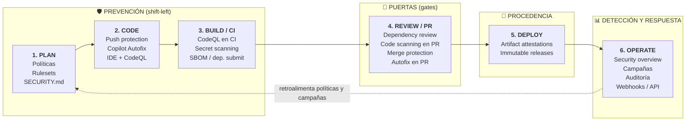
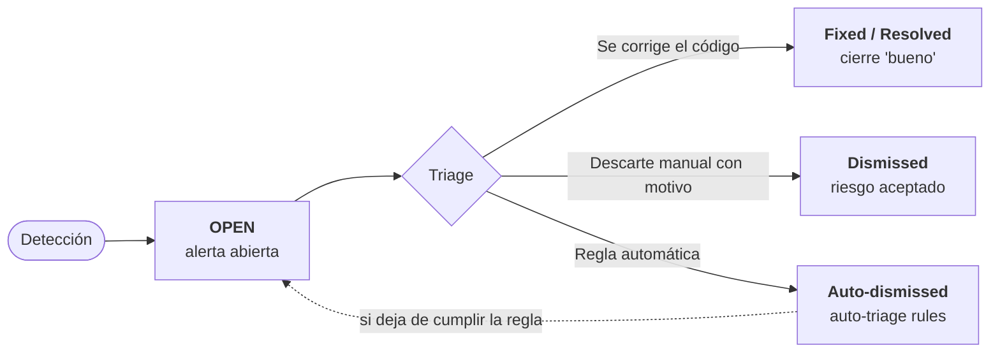
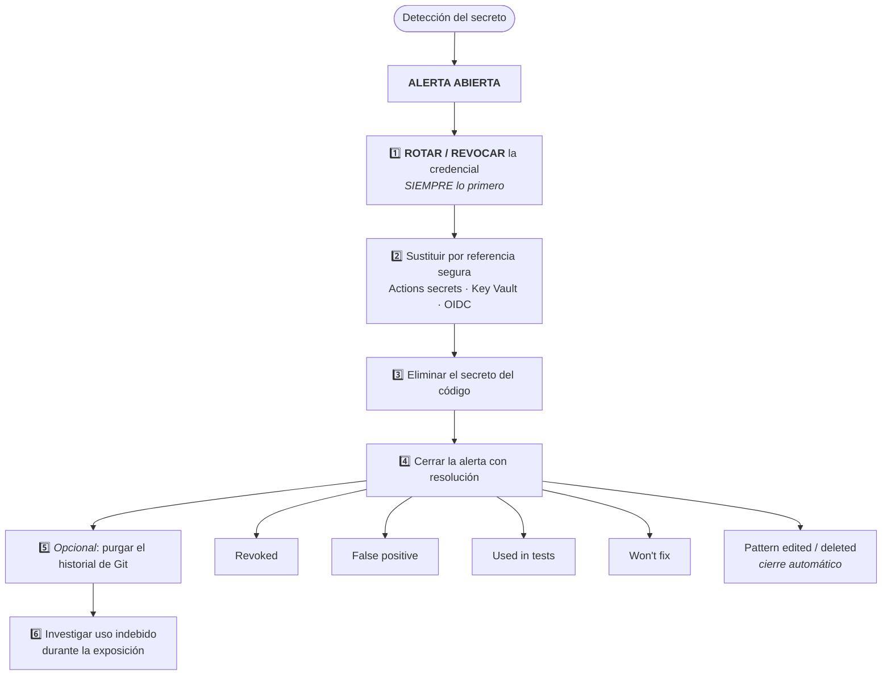
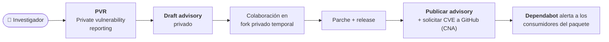
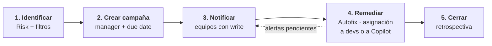
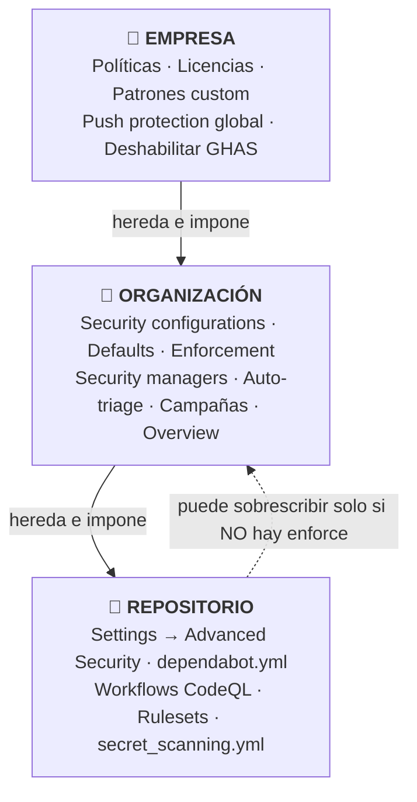

# GH-500 — GitHub Advanced Security · Guía de Estudio Integral (ES)

> Material de estudio autocontenido para el examen **GH-500: GitHub Advanced Security**  
> Basado en el temario oficial (*Skills measured*, actualización **julio 2026**) y en la documentación de GitHub Docs.  
> Última revisión del contenido: **agosto 2026**.

---

## Índice

- [0. Cómo usar este material](#0-cómo-usar-este-material)
- [1. Datos del examen](#1-datos-del-examen)
- [2. Mapa mental del ecosistema GHAS](#2-mapa-mental-del-ecosistema-ghas)
- [3. Glosario maestro](#3-glosario-maestro)
- [Dominio 1 — Suites de seguridad, características y ecosistema (15–20%)](#dominio-1--suites-de-seguridad-características-y-ecosistema-1520)
- [Dominio 2 — Secret Protection (15–20%)](#dominio-2--secret-protection-secret-scanning-1520)
- [Dominio 3 — Supply Chain Security (15–20%)](#dominio-3--supply-chain-security-dependabot--dependency-review-1520)
- [Dominio 4 — Code Security / CodeQL (10–15%)](#dominio-4--code-security-code-scanning-con-codeql-1015)
- [Dominio 5 — Operaciones de seguridad (15–20%)](#dominio-5--operaciones-de-seguridad-buenas-prácticas-priorización-y-corrección-1520)
- [Dominio 6 — Administración de las suites (10–15%)](#dominio-6--administración-de-las-suites-de-seguridad-1015)
- [7. Chuletas (cheat sheets)](#7-chuletas-cheat-sheets)
- [8. Trampas frecuentes del examen](#8-trampas-frecuentes-del-examen)
- [9. Simulacro de examen — 80 preguntas](#9-simulacro-de-examen--80-preguntas)
- [10. Solucionario razonado](#10-solucionario-razonado)
- [11. Plan de estudio de 3 semanas](#11-plan-de-estudio-de-3-semanas)
- [12. Laboratorios prácticos sugeridos](#12-laboratorios-prácticos-sugeridos)

---

## 0. Cómo usar este material

Cada dominio sigue esta estructura pedagógica:

1. **🔥 Preguntas de activación** — respóndelas *antes* de leer. Sirven para activar conocimiento previo y detectar huecos.
2. **📚 Contenido detallado** — teoría, tablas comparativas, YAML, comandos y matices.
3. **✅ Validación de conocimiento** — preguntas abiertas cortas para autoevaluarte tras leer. Si no puedes responderlas en voz alta en 30 segundos, relee.
4. **⚠️ Puntos calientes del examen** — matices concretos que GitHub suele evaluar.

Al final tienes un **simulacro de 80 preguntas** con **solucionario razonado**.

> **Regla de oro de estudio:** en GH-500 la mayoría de fallos vienen de **quién puede hacer qué** (permisos), **qué está habilitado por defecto** y **qué requiere licencia**. Domina esas tres tablas y ya tienes ~30% del examen.

---

## 1. Datos del examen

| Aspecto | Detalle |
|---|---|
| Código | **GH-500** |
| Nombre | GitHub Advanced Security |
| Propietario | Examen **mantenido por GitHub**, distribuido por Microsoft (Pearson VUE) |
| Nivel | Intermedio |
| Duración | **100 minutos** |
| Puntuación de aprobado | **700 / 1000** |
| Idiomas | Inglés, **Español**, Portugués (Brasil), Coreano, Japonés |
| Formato | Opción múltiple, respuesta múltiple, arrastrar-y-soltar, casos de estudio, posibles componentes interactivos |
| Renovación | Anual, mediante evaluación gratuita en Microsoft Learn |
| Reintento | 24 h tras el primer intento; después, tiempos crecientes |
| Sandbox de examen | `https://GHCertDemo.starttest.com` |

### Distribución por dominios (julio 2026)

| # | Dominio | Peso | Preguntas aprox. (sobre ~55) |
|---|---|---|---|
| 1 | Describir las suites de seguridad, características y ecosistema | 15–20% | 9–11 |
| 2 | Configurar y usar **Secret Protection** (antes secret scanning) | 15–20% | 9–11 |
| 3 | Configurar y usar **Supply Chain Security** (antes Dependabot / Dependency Review) | 15–20% | 9–11 |
| 4 | Configurar y usar **Code Security** (antes Code Scanning con CodeQL) | 10–15% | 6–8 |
| 5 | **Operaciones de seguridad**: buenas prácticas, priorización y corrección | 15–20% | 9–11 |
| 6 | **Administración** de las suites de seguridad de GitHub | 10–15% | 6–8 |

> ⚠️ **Cambio crítico de nomenclatura (2025-2026):** el examen ya **no** habla de "GHAS" como un único SKU. Habla de **dos productos**: **GitHub Code Security** y **GitHub Secret Protection**. "GitHub Advanced Security" es el término paraguas. Si una pregunta dice "necesita una licencia de GHAS", tradúcela mentalmente a "necesita Code Security **o** Secret Protection, según la característica".

---

## 2. Mapa mental del ecosistema GHAS

```mermaid
graph TD
    A[GitHub Advanced Security] --> B[GitHub Code Security]
    A --> C[GitHub Secret Protection]
    A --> D[Funciones incluidas en todos los planes]

    B --> B1[Code scanning / CodeQL]
    B --> B2[CodeQL CLI]
    B --> B3[Copilot Autofix]
    B --> B4[AI-powered security detections]
    B --> B5[Dependency review]
    B --> B6[Custom auto-triage rules Dependabot]
    B --> B7[Security campaigns - código]
    B --> B8[Security overview]

    C --> C1[Secret scanning]
    C --> C2[Push protection]
    C --> C3[AI-detected secrets]
    C --> C4[Custom patterns]
    C --> C5[Delegated bypass + Delegated alert dismissal]
    C --> C6[Security campaigns - secretos]
    C --> C7[Security overview]

    D --> D1[Dependency graph]
    D --> D2[Dependabot alerts]
    D --> D3[Dependabot security & version updates]
    D --> D4[GitHub Advisory Database]
    D --> D5[Private vulnerability reporting]
    D --> D6[Artifact attestations / Immutable releases]
```



### Ciclo de vida seguro (SSDLC) con GitHub

| Fase | Estrategia | Características de GitHub |
|---|---|---|
| **1. Plan** | Prevención (shift-left) | Políticas de empresa/organización · Rulesets · `SECURITY.md` · Security configurations |
| **2. Code** | Prevención (shift-left) | **Push protection** · Copilot Autofix en el IDE · Extensión CodeQL para VS Code |
| **3. Build / CI** | Prevención (shift-left) | CodeQL en CI · Secret scanning · SBOM / Dependency Submission API |
| **4. Review / PR** | **Puertas (gates)** | Dependency review · Code scanning en PR · Merge protection (ruleset) · Autofix en PR |
| **5. Deploy** | **Procedencia** | Artifact attestations · Immutable releases · Verificación en el despliegue |
| **6. Operate** | Detección y respuesta | Security overview · Security campaigns · Audit log · Webhooks / REST API |



> 🧠 **Idea clave:** cuanto más a la izquierda detectas el problema, más barato es corregirlo. Las **puertas** son la red de seguridad, no la primera línea de defensa.

---

## 3. Glosario maestro

| Término | Definición operativa |
|---|---|
| **GHAS** | Término paraguas para Code Security + Secret Protection. |
| **Code Security** | SKU con code scanning/CodeQL, Autofix, dependency review, campañas, security overview, auto-triage. |
| **Secret Protection** | SKU con secret scanning, push protection, custom patterns, delegated bypass, campañas de secretos. |
| **Alerta** | Hallazgo generado por una característica de seguridad, con estado (open/closed) y motivo de cierre. |
| **Security configuration** | Colección reutilizable de ajustes de habilitación aplicable a repos de una organización. |
| **Ruleset** | Regla de gobierno (rama/etiqueta/push) que puede exigir, entre otras cosas, protección de merge por code scanning. |
| **Delegated bypass** | Flujo de aprobación para saltarse push protection. |
| **Delegated alert dismissal** | Flujo de aprobación para descartar alertas ("Prevent direct alert dismissals"). |
| **SARIF** | *Static Analysis Results Interchange Format*, estándar OASIS JSON para resultados de análisis estático. |
| **CodeQL** | Motor de análisis semántico de GitHub: trata el código como datos y ejecuta consultas (QL) sobre una base de datos del código. |
| **Query suite** | Conjunto de consultas: `default`, `security-extended`, `security-and-quality`. |
| **Build mode** | Cómo CodeQL crea la BD en lenguajes compilados: `none`, `autobuild`, `manual`. |
| **Dependency graph** | Grafo de dependencias directas y transitivas construido desde manifiestos/lockfiles. |
| **GitHub Advisory Database** | Base de avisos: `GHSA-xxxx-xxxx-xxxx`; incluye *GitHub-reviewed* y *unreviewed*, y avisos de **malware**. |
| **CVE** | Identificador público de vulnerabilidad (`CVE-AAAA-NNNN`). |
| **CWE** | Taxonomía de *tipos* de debilidad (`CWE-89` = SQL injection). |
| **CVSS** | Sistema de puntuación de severidad (0.0–10.0) → Low/Medium/High/Critical. |
| **EPSS** | *Exploit Prediction Scoring System*: probabilidad (%) de explotación en los próximos 30 días. |
| **SBOM** | *Software Bill of Materials*; GitHub exporta en formato **SPDX**. |
| **Security campaign** | Agrupación de alertas para remediación coordinada con desarrolladores, con responsable y plazo. |
| **Validity check** | Comprobación con el proveedor de si un secreto detectado sigue **activo**. |
| **Push protection** | Bloqueo del push cuando contiene un secreto detectado. |
| **Auto-triage rules** | Reglas que descartan/posponen automáticamente alertas de Dependabot. |
| **Private vulnerability reporting (PVR)** | Canal privado para que investigadores reporten vulnerabilidades al mantenedor. |
| **Artifact attestation** | Declaración firmada criptográficamente sobre la procedencia de un artefacto construido con Actions. |

---

# Dominio 1 — Suites de seguridad, características y ecosistema (15–20%)

## 🔥 Preguntas de activación

1. Si tu organización solo compra **Secret Protection**, ¿puedes usar CodeQL en repos privados?
2. ¿Qué diferencia hay entre una estrategia *prevention-first* y una *gate-based*? ¿Cuál usa push protection?
3. ¿Quién ve las alertas de secret scanning de un repositorio privado por defecto?
4. ¿Qué pasa con las alertas abiertas de un repositorio cuando lo archivas?
5. ¿Por qué "descartar" una alerta no es lo mismo que "resolverla"?

---

## 1.1 Estructura de las suites y navegación

### Navegación clave (memorízala)

| Nivel | Ruta | Qué encuentras |
|---|---|---|
| Repositorio | Pestaña **Security** | Overview, Dependabot alerts, Code scanning alerts, Secret scanning alerts, Security policy, Advisories |
| Repositorio | **Settings → Advanced Security** (o *Code security and analysis*) | Habilitar/deshabilitar cada característica |
| Repositorio | **Insights → Dependency graph** | Dependencies, Dependents, Dependabot |
| Organización | **Settings → Advanced Security → Security configurations** | Crear/aplicar configuraciones |
| Organización | Pestaña **Security** | Security overview (Overview, Risk, Coverage, Assessments, Campaigns, Enablement...) |
| Empresa | **Enterprise settings → Code security** / **Policies** | Políticas, habilitación a escala, licencias |
| Empresa | Pestaña **Security** | Security overview agregado |

### Los tres pilares

| Pilar | Pregunta que responde | Herramientas |
|---|---|---|
| **Code Security** | ¿Mi *propio código* tiene vulnerabilidades? | CodeQL, terceros vía SARIF, Copilot Autofix, detección con IA |
| **Secret Protection** | ¿He filtrado *credenciales*? | Secret scanning, push protection, custom patterns, validity checks |
| **Supply Chain Security** | ¿Mis *dependencias* son seguras y confiables? | Dependency graph, Dependabot (alerts/updates), Dependency review, SBOM, attestations |

> 🧠 **Regla nemotécnica: "MI CÓDIGO / MIS LLAVES / EL CÓDIGO AJENO".**

---

## 1.2 Disponibilidad: público vs privado/enterprise

### Tabla maestra de disponibilidad

| Característica | Repo **público** | Repo **privado/interno** sin licencia | Con **Code Security** | Con **Secret Protection** |
|---|---|---|---|---|
| Dependency graph | ✅ Siempre activo, **no se puede desactivar** | ⚠️ Desactivado por defecto; lo activa un admin | ✅ | — |
| Dependabot alerts | ⚠️ **No** activado por defecto (el admin lo activa) | ⚠️ No activado por defecto | ✅ | — |
| Dependabot security updates | ⚠️ No por defecto | ⚠️ No por defecto | ✅ | — |
| Dependabot version updates | ⚠️ No por defecto (requiere `dependabot.yml`) | ⚠️ No por defecto | ✅ | — |
| **Dependency review** | ✅ Activo y no desactivable | ❌ | ✅ | — |
| **Custom auto-triage rules** | ❌ | ❌ | ✅ | — |
| Code scanning (CodeQL) | ✅ Gratis | ❌ | ✅ | — |
| CodeQL CLI | ✅ | ❌ | ✅ | — |
| **Copilot Autofix** | ✅ | ❌ | ✅ | — |
| AI-powered security detections | ❌ | ❌ | ✅ | — |
| Secret scanning | ✅ Automático y gratis | ❌ | — | ✅ |
| Push protection (repositorio) | ✅ (se habilita) | ❌ | — | ✅ |
| Push protection **para usuarios** | ✅ **Activada por defecto** (solo GitHub.com, solo repos públicos) | n/a | — | — |
| AI-detected secrets | ❌ | ❌ | — | ✅ |
| Custom patterns | ❌ | ❌ | — | ✅ |
| Delegated bypass / delegated dismissal | ❌ | ❌ | — | ✅ |
| Security campaigns | ❌ | ❌ | ✅ (código) | ✅ (secretos) |
| Security overview (vistas completas) | ❌ | ❌ | ✅ | ✅ |
| Private vulnerability reporting | ✅ | ✅ | ✅ | ✅ |
| Artifact attestations | ✅ (hay que generarlas) | Solo **GHEC** | — | — |
| Immutable releases | ✅ (se habilita) | ✅ (se habilita) | — | — |

> ⚠️ **Trampa clásica:** *secret scanning* y *code scanning* son **gratis en repos públicos**, pero **security overview, custom patterns, campañas y delegated bypass NO lo son**, ni siquiera en públicos. Necesitan licencia.

> ⚠️ **Otra trampa:** el *dependency graph* está **siempre activo en repos públicos y no se puede desactivar**, pero eso **no** significa que las alertas de Dependabot estén activas.

### Evaluaciones gratuitas de riesgo (sin licencia)

Organizaciones en **GitHub Team** o **GitHub Enterprise** pueden ejecutar gratis:

- **Secret risk assessment**: escanea la organización buscando secretos filtrados y muestra cuántos habría evitado push protection.
- **Code security risk assessment**: escanea hasta **20** de los repos más activos y muestra cuántas vulnerabilidades podría arreglar Copilot Autofix.

Se encuentran en la vista **Assessments** de Security overview.

---

## 1.3 Security Overview: características y beneficios

Security overview existe a **nivel de organización** y **nivel de empresa**. Todas las vistas muestran datos de la **rama por defecto** de los repos que puedes ver.

| Vista | Para qué sirve |
|---|---|
| **Overview (dashboard)** | Tendencias de **Detection**, **Remediation** y **Prevention**. |
| **Risk** | Riesgo actual por tipo de alerta: dependencias vulnerables, debilidades de código, secretos. |
| **Coverage** | Adopción de características de seguridad por repositorio (¿quién no lo tiene activado?). |
| **Assessments** | Informe gratuito de riesgo de secretos (incluso sin licencia). |
| **Campaigns** | Crear y seguir campañas de remediación. |
| **Enablement** | Velocidad de adopción por equipos. |
| **CodeQL pull requests** | Impacto de CodeQL en PRs y cómo se resuelven las alertas. |
| **Dependabot** | Priorizar y seguir vulnerabilidades críticas de dependencias. |
| **Secret scanning** | Qué tipos de secreto bloquea push protection y qué equipos hacen bypass. |

**Otras capacidades:**
- Filtros combinables (al filtrar, **todas** las métricas se recalculan).
- **Exportación a CSV** para análisis externo.
- **REST API** para automatizar.

### Precisión de datos (matiz de examen)

- Las métricas históricas **pueden cambiar** al consultarlas en distintos momentos (repos borrados, advisories modificados). Para **cumplimiento y auditoría** usa el **audit log**, no el dashboard.
- Los **datos de alerta son históricos**, pero los **atributos del repositorio son actuales**. Si archivas un repo hoy, sus alertas abiertas se **cierran automáticamente**, pero al mirar la semana pasada aparecerán como abiertas y el repo solo saldrá si filtras "archivados".
- Si un repo no muestra alertas, puede ser que **no tenga la característica habilitada**, no que sea seguro.

### Acceso a datos

| Rol | Qué ve |
|---|---|
| **Organization owner** / **Security manager** | Datos de **todos** los repos de la organización |
| **Organization member** | Solo repos donde tiene acceso a las alertas |
| **Enterprise owner** | Datos agregados de las orgs donde además es owner/security manager. Para detalle a nivel repo necesita rol en la org |

---

## 1.4 SSDLC seguro y estrategias: prevención vs puertas

| Enfoque | Definición | Ejemplos en GitHub | Ventaja | Riesgo |
|---|---|---|---|---|
| **Prevention-first (shift-left)** | Impedir que el problema **entre** | Push protection, Copilot Autofix en el IDE, plantillas seguras, `dependabot.yml` proactivo, cooldown | Coste de corrección mínimo; no genera deuda | Fricción para el dev si no hay vía de escape |
| **Gate-based (puertas)** | Detectar y **bloquear** en un punto de control | Dependency review action con `fail-on-severity`, rulesets de merge protection por code scanning, required checks | Control fuerte y auditable | Se descubre tarde; puede bloquear entregas |
| **Detect & remediate (a posteriori)** | Encontrar lo ya introducido | Escaneos programados, campañas, auto-triage | Reduce deuda existente | Ventana de exposición |

> 🧠 **Frase de examen:** *"Push protection es la característica prevention-first por excelencia porque evita que el secreto llegue al historial de Git; una vez está en el historial, la única remediación fiable es **rotar** la credencial."*

### Interacción Secret Protection ↔ Code Security

- Son **complementarios, no sustitutivos**: Secret Protection busca **credenciales** (datos), Code Security busca **debilidades de código** (lógica).
- Un secreto **hardcodeado** puede además ser detectado por reglas de calidad/seguridad de CodeQL (p. ej. credenciales embebidas), pero **la fuente de verdad para credenciales es secret scanning**.
- Ambos alimentan **Security overview** y ambos soportan **campañas** y **delegated alert dismissal**.
- Orden recomendado de despliegue: **Secret Protection primero** (impacto inmediato, bajo ruido, sin builds) → **Supply chain** → **Code Security** (requiere CI, más ruido inicial).

---

## 1.5 Detección, gestión y respuesta a alertas

### Mecanismos de detección por tipo

| Tipo de alerta | Cómo se detecta | Disparadores |
|---|---|---|
| **Secret scanning** | Coincidencia de patrones (partner, provider, genéricos, custom, IA) contra **todo el historial de Git en todas las ramas** + issues, PRs, discussions, wikis, gists secretos | Push, nuevo patrón añadido, reescaneos periódicos |
| **Push protection** | Mismos patrones, aplicados **en el momento del push** | Push CLI, commit en UI web, subida de archivos, REST API, MCP server (repos públicos) |
| **Dependabot alerts** | Cruce de **dependency graph** con **GitHub Advisory Database** | Nuevo advisory publicado; cambio del dependency graph |
| **Dependabot malware alerts** | Advisories de **paquetes maliciosos** | Igual que arriba |
| **Code scanning** | Análisis estático (CodeQL o terceros vía SARIF) | `push`, `pull_request`, `schedule`, `workflow_dispatch`, `merge_group`, subida de SARIF |
| **Dependency review** | Diff de dependencias en el PR usando el dependency graph | Apertura/actualización del PR |

### Ciclo de vida genérico de una alerta



| Estado final | Qué significa | Riesgo residual |
|---|---|---|
| **Fixed / Resolved** | El problema se corrigió de verdad | Ninguno |
| **Dismissed** | Alguien decidió no arreglarlo (con motivo) | **Sí** — es deuda de seguridad |
| **Auto-dismissed** | Una auto-triage rule lo descartó al crearse | **Sí** — no genera ni notificación |

### Implicaciones de descartar / ignorar alertas

- Descartar **no elimina el riesgo**: solo lo saca de la vista.
- **Siempre** exige motivo + comentario. Los motivos son auditables y aparecen en el **audit log** y en Security overview.
- Un secreto descartado como "falso positivo" que en realidad era válido = credencial viva en producción.
- Buenas prácticas:
  - Exigir **delegated alert dismissal** ("Prevent direct alert dismissals") en repos críticos.
  - Documentar la justificación con enlace a ticket/riesgo aceptado.
  - Revisar periódicamente las alertas descartadas (son deuda técnica de seguridad).
  - Usar **auto-triage rules** para descartes **sistemáticos y justificables** (p. ej. dependencias de desarrollo de bajo impacto), no descartes manuales masivos.

### Responsabilidades por rol

| Rol | Responsabilidad principal |
|---|---|
| **Desarrollador** | Corregir alertas de su código y sus PRs; no hacer bypass sin justificación; rotar sus propias credenciales filtradas |
| **Security manager / AppSec** | Definir políticas, priorizar, crear campañas, revisar bypass y dismissals, definir custom patterns y auto-triage |
| **Repository admin** | Habilitar características a nivel repo, gestionar acceso a alertas, configurar rulesets |
| **Organization owner** | Configuraciones de seguridad, defaults, enforcement, security managers |
| **Enterprise owner** | Políticas de empresa, licencias, habilitación a escala, deshabilitar GHAS globalmente |

---

## ✅ Validación de conocimiento — Dominio 1

1. Nombra 4 características que estén en **Code Security** y 4 en **Secret Protection**.
2. ¿Qué característica de supply chain **no se puede desactivar** en un repositorio público?
3. ¿Un repositorio público tiene alertas de Dependabot activadas de fábrica? Justifica.
4. Cita 3 vistas de Security overview y para qué sirve cada una.
5. ¿Por qué el dashboard de Security overview no sirve para evidencias de auditoría?
6. Explica en una frase la diferencia entre *prevention-first* y *gate-based*, con un ejemplo de cada uno.
7. ¿Qué ve un *enterprise owner* que **no** es owner de una organización concreta?

---

# Dominio 2 — Secret Protection (secret scanning) (15–20%)

## 🔥 Preguntas de activación

1. Si un secreto ya está en el historial, ¿qué haces primero: reescribir el historial o rotar la credencial?
2. ¿Qué ocurre exactamente cuando un dev hace bypass de push protection eligiendo *"I'll fix it later"*?
3. ¿Puede un colaborador con acceso de escritura descartar cualquier alerta de secretos? ¿Siempre?
4. ¿Qué es una *validity check* y por qué cambia tu priorización?
5. ¿Cuánto tiempo dura una solicitud de bypass sin revisar?

---

## 2.1 Qué escanea secret scanning

Escanea **todo el historial de Git, en todas las ramas**, buscando credenciales hardcodeadas: claves de API, contraseñas, tokens, certificados privados, cadenas de conexión…

Además escanea automáticamente:

- Descripciones y comentarios de **issues** (abiertos y **cerrados/históricos**: títulos, descripciones y comentarios)
- Títulos, descripciones y comentarios de **pull requests**
- Títulos, descripciones y comentarios de **GitHub Discussions**
- **Wikis**
- **Gists secretos**

GitHub además **reescanea periódicamente** los repositorios cuando se añaden **nuevos tipos de secreto**.

> ⚠️ **Trampa:** el escaneo cubre el **historial completo**, no solo el último commit. Por eso al activar Secret Protection en un repo antiguo suele aparecer una avalancha inicial de alertas.

### Concepto: *secret sprawl*

Proliferación descontrolada de credenciales por múltiples repos, ramas, issues y wikis. Secret scanning existe precisamente para hacer visible y medible ese *sprawl*.

---

## 2.2 Tipos de patrones

| Tipo de patrón | Descripción | Requiere licencia |
|---|---|---|
| **Partner patterns** | Patrones de proveedores asociados al **Secret Scanning Partner Program**. En repos **públicos**, el secreto se **notifica directamente al proveedor** (que puede revocarlo) y **no** se muestra como alerta en tu repo. | No (público) |
| **Provider patterns** | Patrones de proveedores conocidos que **sí** generan alerta en tu repositorio. | Secret Protection (privado) |
| **Generic patterns** | Secretos no atados a un proveedor: claves privadas, cadenas de conexión, API keys genéricas. Mayor ruido → se habilita/deshabilita aparte. | Secret Protection |
| **Custom patterns** | Expresiones regulares definidas por ti (empresa/org/repo). | Secret Protection |
| **AI-detected secrets** | Detección con IA de credenciales **no estructuradas** (p. ej. contraseñas en texto libre). | Secret Protection |

### Secret Scanning Partner Program (matiz clave)

- Aplica a **repos públicos**.
- Cuando se detecta un secreto de partner, **GitHub avisa al proveedor**, no a ti mediante alerta.
- El proveedor decide: revocar, emitir uno nuevo, notificar al cliente.
- **No aparece** en la lista de alertas del repositorio.

---

## 2.3 Push protection

### Qué bloquea

Push protection bloquea secretos detectados en:

- Pushes desde la **línea de comandos**
- Commits hechos en la **UI de GitHub**
- **Subida de archivos** a un repositorio en GitHub
- Peticiones a la **REST API**
- Interacciones con el **GitHub MCP server** (solo repos públicos)

Cuando detecta un posible secreto: **bloquea el push** y muestra un mensaje explicando el motivo. El usuario debe revisar, eliminar el secreto y reintentar.

### Dos tipos de push protection

| Tipo | Ámbito | Por defecto | Requiere | Genera alertas al bypass |
|---|---|---|---|---|
| **Push protection para repositorios** | Repo / org / empresa | **Desactivada** | Secret Protection | ✅ Sí |
| **Push protection para usuarios** | Tu cuenta, solo **GitHub.com** | **Activada** | — | ❌ No (salvo que también esté activa a nivel repo) |

- La de **usuarios** solo te impide **subir secretos a repositorios públicos**.
- La activan/desactivan: administrador de repo, propietario de org, security manager o propietario de empresa (para la de repositorios).

### Bypass: motivos y consecuencias

Por defecto, **cualquiera con acceso de escritura** puede hacer bypass indicando un motivo:

| Motivo de bypass | Comportamiento de la alerta |
|---|---|
| **It's used in tests** (se usa en pruebas) | GitHub crea una alerta **cerrada**, resuelta como *"used in tests"* |
| **It's a false positive** (falso positivo) | GitHub crea una alerta **cerrada**, resuelta como *"false positive"* |
| **I'll fix it later** (lo arreglaré luego) | GitHub crea una alerta **ABIERTA** |

Además, en **todos** los casos GitHub:
- Añade el evento de bypass al **audit log**.
- Envía **email** a propietarios de cuenta/org/empresa, security managers y administradores del repo que estén *watching*, con enlace al secreto y el motivo.

> ⚠️ **Pregunta típica:** *"Un dev hace bypass indicando 'false positive'. ¿Qué ve el equipo de seguridad?"* → Una alerta **cerrada** con resolución *false positive*, un evento en el audit log y una notificación por email.

### Delegated bypass for push protection

Permite un **proceso de aprobación**:

- **Bypass privileges**: actores que pueden saltarse push protection ellos mismos **y** revisar/aprobar solicitudes de otros.
- **Exemptions**: actores **exentos** de push protection por completo (para automatización de confianza: bots de migración, cuentas de servicio).
- **Ciclo de revisión**: el resto de contribuidores debe **solicitar** el bypass. **Las solicitudes expiran a los 7 días.**
- Se aplica también a archivos creados, editados y subidos **en GitHub**.

**Siempre pueden hacer bypass:**
- Organization owners
- Security managers
- Usuarios en equipos, roles por defecto o roles personalizados añadidos a la **lista de bypass**
- Usuarios con un rol personalizado que tenga el permiso granular *"review and manage secret scanning bypass requests"*

---

## 2.4 Validity checks y metadatos extendidos

| Concepto | Qué hace | Efecto en la priorización |
|---|---|---|
| **Validity check** | Contacta con el servicio emisor para saber si la credencial **sigue activa** | Un secreto **activo** = crítico e inmediato. Un secreto ya revocado = prioridad baja |
| **Extended metadata** | Información adicional del token (p. ej. propietario, permisos, alcance) | Permite evaluar el **radio de explosión** |
| **Prioritized alerting** | GitHub prioriza alertas de **alta confianza** y secretos válidos | Reduce ruido y acelera la respuesta |

> Requisito: **extended metadata solo se puede habilitar si validity checks está habilitado**.

> Distinción de examen: las *validity checks* verifican secretos **de tus alertas**; el *partner program* notifica al proveedor para revocación. **Son cosas distintas.**

---

## 2.5 Ciclo de vida y remediación de alertas de secretos



### Orden correcto de remediación (memorízalo)

1. **Rotar / revocar** la credencial expuesta en el proveedor. *(Esto es lo primero, siempre.)*
2. Sustituirla por una referencia segura (GitHub Actions secrets, Key Vault, OIDC…).
3. Eliminar el secreto del código actual y hacer commit.
4. Cerrar la alerta con la resolución adecuada.
5. **Opcional**: reescribir el historial. GitHub lo describe como *time-intensive* y **a menudo innecesario si ya has revocado**.
6. Investigar el uso indebido de la credencial mientras estuvo expuesta.

> ⚠️ **Trampa de oro:** la respuesta "reescribir el historial con `git filter-repo` / BFG" **casi nunca es la primera acción correcta**. Rotar la credencial lo es. Un secreto en un fork, en un clon local o en un caché ya está fuera de tu control.

### Quién puede ver y gestionar alertas de secret scanning

- Propietarios de organización, security managers y administradores de repositorio.
- Usuarios/equipos a quienes el administrador conceda acceso explícito a las alertas.
- Se pueden configurar **destinatarios de alertas** y **exclusiones** (rutas a ignorar mediante `secret_scanning.yml`).
- Al **asignar** una alerta de secretos a alguien que **no puede ver la lista de alertas**, sus permisos se elevan **temporalmente para esa alerta**; se revocan al desasignarlo.

### Delegated alert dismissal ("Prevent direct alert dismissals")

- Impide que los desarrolladores **cierren directamente** alertas.
- Los cierres pasan por una **solicitud + aprobación**.
- Se configura en la **security configuration** y existe para **secret scanning, code scanning y Dependabot**.

---

## 2.6 Custom patterns

- Se definen como **expresiones regulares**.
- Se pueden crear a nivel de **empresa**, **organización** o **repositorio**.
- Se puede activar **push protection** para un custom pattern (bloquea esos secretos en el push).
- Flujo típico: definir → **dry run** para medir falsos positivos → publicar → revisar alertas.
- Un patrón admite: patrón secreto, "before/after secret", "additional match/not match" requirements.
- Si se **edita** o **borra** un patrón, las alertas asociadas se cierran automáticamente (`pattern_edited` / `pattern_deleted`).

> Requieren **Secret Protection** (no disponibles gratis ni en repos públicos).

---

## 2.7 Monitorización pública (public monitoring)

Además de escanear los repos de tu empresa, puedes habilitar **public monitoring** para detectar secretos filtrados por **miembros de tu empresa en repos públicos de todo GitHub**. Extiende el alcance más allá de los repos que posees.

---

## ✅ Validación de conocimiento — Dominio 2

1. Enumera los 5 vectores donde push protection bloquea secretos.
2. ¿Qué motivo de bypass genera una alerta **abierta**?
3. ¿Cuánto tardan en expirar las solicitudes de delegated bypass?
4. ¿Cuál es la **primera** acción tras detectar un secreto real filtrado?
5. ¿Qué diferencia hay entre el partner program y una validity check?
6. Nombra 3 tipos de usuario que **siempre** pueden hacer bypass de push protection.
7. ¿Qué requisito tiene habilitar *extended metadata*?
8. ¿A qué niveles se pueden definir custom patterns?

---

# Dominio 3 — Supply Chain Security (Dependabot + Dependency Review) (15–20%)

## 🔥 Preguntas de activación

1. ¿Cuál es la diferencia esencial entre *security updates* y *version updates*?
2. ¿Cuál de los dos **no** usa el dependency graph?
3. ¿Cuántos PRs abiertos permite Dependabot por defecto? ¿Aplica a los de seguridad?
4. ¿Qué formato de SBOM exporta GitHub?
5. ¿Qué mide EPSS y en qué se diferencia de CVSS?

---

## 3.1 El dependency graph

- Se construye analizando **manifiestos y lockfiles** conocidos del repositorio.
- Incluye dependencias **directas** y **transitivas**.
- Se **actualiza automáticamente** al hacer push que cambie/añada un manifiesto o lockfile en la **rama por defecto**, y también cuando alguien hace un cambio en el repo de una de tus dependencias.
- Puede enriquecerse en **tiempo de build** con GitHub Actions (**Dependency Submission API**) — clave para ecosistemas que resuelven transitivas en build (Gradle, Maven, Go…).
- Se ve en **Insights → Dependency graph** (Dependencies / Dependents).
- Con acceso de **lectura** puedes **exportar el SBOM** (formato **SPDX**) desde la **UI** o la **REST API**.
- Las dependencias enviadas vía Dependency Submission API muestran **qué detector** las envió y **cuándo**.

**Alimenta a:**
- Dependency review (diff de dependencias en el PR)
- Dependabot alerts (cruzando con el Advisory Database)
- Dependabot **security** updates

> ⚠️ **Dependabot *version* updates NO usa el dependency graph**: se basa en el **versionado semántico** de las dependencias declaradas.

---

## 3.2 GitHub Advisory Database y modelos de puntuación

| Concepto | Detalle |
|---|---|
| **GHSA ID** | `GHSA-xxxx-xxxx-xxxx`; identificador propio de GitHub |
| **GitHub-reviewed** | Avisos revisados por GitHub. **Solo estos generan alertas de Dependabot** |
| **Unreviewed** | Importados (p. ej. de NVD) sin revisión; informativos |
| **Malware advisories** | Paquetes maliciosos → **Dependabot malware alerts** |
| **CVE** | Identificador público de la vulnerabilidad concreta |
| **CWE** | Clase o *tipo* de debilidad (CWE-79 XSS, CWE-89 SQLi, CWE-22 path traversal, CWE-798 credenciales embebidas) |
| **CVSS** | Severidad técnica 0.0–10.0 → Low (0.1–3.9), Medium (4.0–6.9), High (7.0–8.9), Critical (9.0–10.0) |
| **EPSS** | **Probabilidad de explotación en los próximos 30 días** (0–100%). Complementa a CVSS: *"¿es grave?"* vs *"¿lo van a explotar?"* |

> 🧠 **Priorización moderna = CVSS (impacto) × EPSS (probabilidad) × contexto (¿está en producción? ¿es alcanzable?)**. GitHub expone EPSS en las alertas de Dependabot y permite filtrar/ordenar por él.

### Cuándo se generan alertas de Dependabot

Dependabot escanea la **rama por defecto** y alerta cuando:
- Se **añade un nuevo advisory** a la GitHub Advisory Database, **o**
- **Cambia el dependency graph** del repositorio (p. ej. haces push de un manifiesto actualizado).

### Limitaciones de Dependabot alerts (¡preguntable!)

- No detecta todos los problemas de seguridad.
- Puede haber **latencia** entre la divulgación y la publicación del advisory.
- **Solo los advisories revisados por GitHub** generan alertas.
- **No escanea repositorios archivados.**
- Para **GitHub Actions**, solo genera alertas para acciones con **versionado semántico**, **no** para las fijadas por **SHA**.

---

## 3.3 Dependabot: los cuatro sabores

| Característica | Disparador | ¿Requiere `dependabot.yml`? | Objetivo de versión | Usa dependency graph |
|---|---|---|---|---|
| **Dependabot alerts** | Nuevo advisory o cambio del grafo | ❌ | — | ✅ |
| **Dependabot malware alerts** | Advisory de paquete malicioso | ❌ | — | ✅ |
| **Dependabot security updates** | Una alerta de Dependabot | ❌ (opcional, para sobrescribir el comportamiento) | **Versión mínima** que resuelve la vulnerabilidad | ✅ |
| **Dependabot version updates** | **Schedule** que tú defines | ✅ **Obligatorio** | **Última** versión que cumpla la config | ❌ (usa SemVer) |

### Dónde se ejecuta Dependabot

- Si **GitHub Actions está habilitado** en el repo → Dependabot updates se ejecuta **en GitHub Actions**.
- Si **no** lo está → GitHub genera las alertas con la **aplicación Dependabot integrada**.
- Los PRs de Dependabot **pueden disparar workflows** (con `pull_request` y el contexto `github.actor == 'dependabot[bot]'`, secretos de Dependabot, `permissions` explícitos).

### Notificaciones

Por defecto, GitHub envía email a quien **a la vez**:
- tenga permisos **write, maintain o admin** en el repo, **y**
- esté **watching** el repo con notificaciones de alertas de seguridad activadas.

Al habilitar Dependabot por primera vez **no** se notifican todas las dependencias vulnerables existentes; solo las **nuevas** a partir de ese momento. Existe digest semanal.

> 💡 Las **auto-triage rules se aplican ANTES de enviar notificaciones**: una alerta auto-descartada al crearse **no** genera notificación. Es la forma correcta de reducir ruido.

### Asignación de alertas

- Usuarios con **write o superior** pueden asignar alertas de Dependabot a colaboradores, equipos o **agentes de IA** (Copilot; agentes de terceros como Codex o Claude si están habilitados).
- Asignar a un agente → crea una sesión y abre un **draft PR** con la corrección propuesta.
- Webhook `dependabot_alert` con evento `assignees_changed`.
- ⚠️ La visibilidad de asignaciones está limitada a la vista de alertas **a nivel repositorio**; el security overview de la organización **no** muestra asignaciones.

---

## 3.4 `dependabot.yml` — referencia práctica

Ruta: **`.github/dependabot.yml`** en la rama por defecto.

### Claves obligatorias

| Clave | Ubicación | Valor |
|---|---|---|
| `version` | raíz | siempre **`2`** |
| `updates` | raíz | lista de bloques |
| `package-ecosystem` | por bloque | `npm`, `pip`, `maven`, `gradle`, `docker`, `github-actions`, `gomod`, `nuget`, `bundler`, `composer`, `cargo`, `terraform`, `swift`, `pub`, `mix`, `gitsubmodule`, `helm`, `uv`, `bun`, `deno`, … |
| `directory` **o** `directories` | por bloque | ubicación de manifiestos |
| `schedule.interval` | por bloque | `daily`, `weekly`, `monthly`, `quarterly`, `semiannually`, `yearly`, `cron` |

### Ejemplo completo comentado

```yaml
version: 2

registries:
  my-npm:
    type: npm-registry
    url: https://npm.pkg.github.com
    token: ${{ secrets.NPM_TOKEN }}
    scope: "@mi-empresa"          # solo npm-registry

multi-ecosystem-groups:
  infraestructura:
    schedule:
      interval: "weekly"

updates:
  - package-ecosystem: "npm"
    directory: "/"
    registries:
      - my-npm
    schedule:
      interval: "weekly"
      day: "monday"
      time: "06:00"
      timezone: "Europe/Madrid"

    open-pull-requests-limit: 10   # por defecto 5 (NO aplica a security updates)
    versioning-strategy: increase  # auto | increase | increase-if-necessary | lockfile-only | widen
    rebase-strategy: auto          # 'disabled' para desactivar rebase automático
    target-branch: "develop"       # ⚠️ los security updates SIEMPRE usan la rama por defecto
    vendor: false                  # solo bundler y gomod
    labels: ["dependencies", "security"]
    assignees: ["equipo-plataforma"]
    milestone: 3
    commit-message:
      prefix: "deps"
      prefix-development: "deps-dev"
      include: "scope"

    cooldown:                      # SOLO version updates, nunca security updates
      default-days: 7              # por defecto GitHub aplica 3 días aunque no lo declares
      semver-major-days: 30
      semver-minor-days: 14
      semver-patch-days: 3
      include: ["*"]
      exclude: ["lodash"]          # exclude SIEMPRE gana sobre include

    allow:
      - dependency-type: "direct"  # direct | indirect | all | production | development
      - dependency-name: "express*"
        update-types: ["version-update:semver-minor", "version-update:semver-patch"]

    ignore:
      - dependency-name: "aws-sdk"
        versions: ["^3.0.0"]
      - dependency-name: "*"
        update-types: ["version-update:semver-major"]

    exclude-paths:
      - "vendor/**"
      - "src/test/assets"

    groups:
      react-stack:
        applies-to: version-updates      # version-updates | security-updates
        dependency-type: production      # development | production
        patterns: ["react", "react-*"]
        exclude-patterns: ["react-native*"]
        update-types: ["minor", "patch"] # major | minor | patch
        group-by: dependency-name        # agrupa entre directorios (solo version updates)

    pull-request-branch-name:
      separator: "-"
      prefix: "deps"
      max-length: 120                    # 20–244, default 100
      word-separator: "-"
      branch-name-case: "lowercase"

  - package-ecosystem: "docker"
    directory: "/"
    multi-ecosystem-group: "infraestructura"
    schedule:
      interval: "cron"
      cronjob: "0 9 * * 1"

  - package-ecosystem: "github-actions"
    directory: "/"                       # ⚠️ SIEMPRE "/" para Actions
    schedule:
      interval: "weekly"
```

### Matices de configuración que caen en el examen

| Opción | Matiz crítico |
|---|---|
| `open-pull-requests-limit` | Default **5**. **Los PRs de security updates NO cuentan ni están limitados.** Poner `0` desactiva version updates para ese ecosistema. |
| `cooldown` | **Solo version updates**. Hay un cooldown por defecto de **3 días** aunque no lo declares. **No aplica a security updates.** |
| `allow` + `ignore` | Se evalúa **primero allow, luego ignore**. Si algo coincide en ambos → **se ignora**. |
| `groups` | Si una dependencia coincide con varias reglas, va al **primer** grupo que coincida. Lo no agrupado va en PRs individuales. |
| `target-branch` | Al definirlo, las opciones del bloque **dejan de aplicarse a security updates** (que siempre usan la rama por defecto). |
| `directory` vs `directories` | **`directories` soporta globbing y `*`; `directory` NO.** |
| `github-actions` | `directory: "/"`; busca en `.github/workflows` y el `action.yml`/`action.yaml` raíz. |
| `insecure-external-code-execution` | Al configurar registries privados, la ejecución de código externo se **desactiva automáticamente**. `allow` la reactiva (riesgo). Solo `bundler`, `mix`, `pip`. |
| `versioning-strategy` | Default `auto`: `increase` para apps, `widen` para librerías. |
| `vendor` | Solo `bundler` y `gomod`. En Go las dependencias vendorizadas se detectan automáticamente. |
| `multi-ecosystem-groups` | Un único PR que actualiza **varios ecosistemas** a la vez. |
| Autenticación de registries | `token`, `username`+`password`, o **OIDC** (`tenant-id` + `client-id`). |

---

## 3.5 Auto-triage rules (reglas de clasificación automática)

Permiten gestionar alertas de Dependabot **a escala**, decidiendo automáticamente qué alertas **descartar (dismiss)**, **posponer (snooze)** o para cuáles **disparar un security update**.

| Tipo | Quién lo tiene | Comportamiento |
|---|---|---|
| **Regla preestablecida de GitHub** (`Dismiss low impact issues for development-scoped dependencies`) | Todos los repos con Dependabot alerts | Descarta automáticamente alertas de baja severidad en dependencias de **desarrollo** de ciertos ecosistemas. Se puede **desactivar**, no editar. |
| **Custom auto-triage rules** | Requiere **Code Security** | Reglas propias por severidad, ecosistema, scope, CWE, ámbito de paquete, etc., a nivel repo u organización. |

**Ventajas:**
- Se aplican **antes de notificar** → menos ruido.
- Aplican a alertas **existentes y futuras**.
- Al **auto-descartar**, la alerta queda cerrada con la razón de la regla y es auditable.
- Si una alerta auto-descartada deja de cumplir la regla, **se reabre**.

> ⚠️ Cuidado: auto-descartar por criterios amplios (p. ej. "todo lo Low") crea puntos ciegos. La buena práctica es acotar por **scope de desarrollo** o por **no alcanzable en runtime**.

---

## 3.6 Dependency review

Dos formas de uso:

### a) Rich diff en el PR
- Pestaña **Files changed** del PR → vista enriquecida.
- Muestra dependencias **añadidas, eliminadas y actualizadas**, con **fecha de publicación**, **popularidad**, **licencia** e **información de vulnerabilidades**.
- Disponible en repos **públicos** por defecto; en privados/internos requiere **Code Security** (u organización con GHAS).

### b) `dependency-review-action` (la puerta de CI)

```yaml
name: 'Dependency Review'
on: [pull_request]

permissions:
  contents: read

jobs:
  dependency-review:
    runs-on: ubuntu-latest
    steps:
      - name: 'Checkout Repository'
        uses: actions/checkout@v6
      - name: Dependency Review
        uses: actions/dependency-review-action@v4
        with:
          fail-on-severity: critical            # low | moderate | high | critical
          allow-licenses: GPL-3.0, BSD-3-Clause, MIT   # ⚠️ mutuamente excluyente con deny-licenses
          # deny-licenses: LGPL-2.0, BSD-2-Clause
          allow-ghsas: GHSA-abcd-1234-5679      # excepciones puntuales por advisory
          fail-on-scopes: development, runtime  # development | runtime | unknown
          # config-file: './.github/dependency-review-config.yml'
          # external-repo-token: ${{ secrets.CONFIG_REPO_TOKEN }}
```

**Puntos de examen:**
- `allow-licenses` y `deny-licenses` **no se pueden usar juntas**: eliges una.
- Las licencias usan identificadores **SPDX**.
- `fail-on-severity` define el **umbral de bloqueo del PR**.
- Se puede configurar **inline** o con **fichero de configuración** (local o en repo externo con `external-repo-token`).
- Requiere que el **dependency graph** esté habilitado.
- Para hacerla obligatoria, conviértela en **required status check** (ruleset / branch protection).

---

## 3.7 SBOM, procedencia e integridad

| Característica | Qué es | Disponibilidad |
|---|---|---|
| **Exportar SBOM** | Exporta el dependency graph como **SBOM compatible con SPDX** desde la UI o la REST API. Requiere acceso de **lectura** | Cualquier repo con dependency graph |
| **Dependency Submission API** | Enviar dependencias resueltas en **build time** desde cualquier ecosistema, incluso no soportado nativamente | Todos |
| **Artifact attestations** | Declaraciones **firmadas criptográficamente** sobre la **procedencia** (código fuente + workflow run) o el SBOM asociado de un artefacto construido con Actions | Públicos: sí. Privados: **solo GHEC** |
| **Immutable releases** | Impide cambiar los assets y el tag de Git de una release tras su publicación; **genera una attestation automáticamente** | Se habilita por repo u org |

> Las attestations **no garantizan que el software sea seguro**: garantizan **de dónde viene y cómo se construyó**. Se pueden verificar en el despliegue (p. ej. admission controller de Kubernetes) para impedir desplegar artefactos no atestiguados.

---

## ✅ Validación de conocimiento — Dominio 3

1. ¿Qué tipo de Dependabot update **necesita obligatoriamente** `dependabot.yml`?
2. ¿A qué versión actualiza un *security update*? ¿Y un *version update*?
3. ¿Cuál es el `open-pull-requests-limit` por defecto y a qué **no** se aplica?
4. Si una dependencia coincide con `allow` y con `ignore`, ¿qué gana?
5. ¿Qué formato de SBOM produce GitHub y con qué permiso mínimo se exporta?
6. Cita 3 limitaciones documentadas de Dependabot alerts.
7. ¿Qué mide EPSS? ¿En qué unidad y ventana temporal?
8. ¿Puedes usar `allow-licenses` y `deny-licenses` a la vez en dependency review?

---

# Dominio 4 — Code Security: code scanning con CodeQL (10–15%)

## 🔥 Preguntas de activación

1. ¿Cuándo elegirías *default setup* y cuándo *advanced setup*?
2. ¿Qué query suite **no** está disponible en default setup?
3. ¿Qué diferencia hay entre `severity` y `security severity`?
4. ¿Cómo integras un SAST de terceros que no es CodeQL?
5. ¿Para qué sirve el parámetro `category` en un monorepo?

---

## 4.1 Enfoques de análisis

| Opción | Cuándo usarla |
|---|---|
| **CodeQL — default setup** | Rápido, sin YAML, gestionado por GitHub; ideal para habilitar a escala en cientos de repos |
| **CodeQL — advanced setup** | Necesitas control: build personalizado, matrices, suites `security-and-quality`, packs, filtros de consultas, self-hosted runners |
| **CodeQL CLI** | Análisis local o en CI externo (Jenkins, GitLab, Azure DevOps) y subida de resultados |
| **Herramientas de terceros vía SARIF** | Ya usas Semgrep, Snyk, Checkmarx, Fortify, ESLint (SARIF)… → suben resultados y se ven junto a los de CodeQL |
| **AI-powered security detections** | Cubre lenguajes/frameworks no soportados por CodeQL; se ejecuta en la **revisión del pull request** (requiere Code Security) |

### Default setup vs Advanced setup

| Aspecto | Default setup | Advanced setup |
|---|---|---|
| Configuración | UI, automática | Fichero `.github/workflows/codeql.yml` |
| Detección de lenguajes | Automática | Manual (matriz) |
| Query suites | `default` y `security-extended` (llamada "Extended") | `default`, `security-extended`, **`security-and-quality`**, packs y consultas propias |
| Build de lenguajes compilados | Automático (`none`/`autobuild`) | Control total, incluido `manual` |
| Fichero de config personalizado | ✅ Sí (soportado, incluso compartido entre repos) | ✅ Sí |
| Runners con etiqueta personalizada | ✅ (vía security configuration) | ✅ |
| Habilitación a escala | ✅ Ideal | ⚠️ Requiere plantillas/automatización |
| Frecuencia | Push a rama por defecto, PRs y programado | Totalmente configurable |

> ⚠️ **`security-and-quality` requiere advanced setup.**

---

## 4.2 Lenguajes e identificadores de CodeQL

| Lenguaje | Identificador | Alternativos |
|---|---|---|
| C/C++ | `c-cpp` | `c`, `cpp` |
| C# | `csharp` | — |
| GitHub Actions (workflows) | `actions` | — |
| Go | `go` | — |
| Java/Kotlin | `java-kotlin` | `java`, `kotlin` |
| JavaScript/TypeScript | `javascript-typescript` | `javascript`, `typescript` |
| Python | `python` | — |
| Ruby | `ruby` | — |
| Rust | `rust` | — |
| Swift | `swift` | — |

> ⚠️ Usar `javascript` **no excluye** TypeScript: es equivalente a `javascript-typescript`. Para excluir código usa `paths-ignore` en la config.  
> ⚠️ **Swift usa runners macOS por defecto** (más caros) y **no** es compatible con Actions Runner Controller (ARC, solo Linux).

---

## 4.3 Anatomía del workflow de CodeQL

```yaml
name: "CodeQL"

on:
  push:
    branches: [main, protected]
  pull_request:
    branches: [main]
    paths-ignore:
      - '**/*.md'
      - '**/*.txt'
  schedule:
    - cron: '20 14 * * 1'      # lunes 14:20 UTC
  merge_group:                  # necesario si usas merge queue
  workflow_dispatch:

jobs:
  analyze:
    name: Analyze (${{ matrix.language }})
    runs-on: ${{ matrix.language == 'swift' && 'macos-latest' || 'ubuntu-latest' }}
    permissions:
      security-events: write     # OBLIGATORIO para subir resultados
      packs: read                # para descargar CodeQL packs
      actions: read
      contents: read
    strategy:
      fail-fast: false
      matrix:
        include:
          - language: javascript-typescript
            build-mode: none
          - language: java-kotlin
            build-mode: autobuild
          - language: c-cpp
            build-mode: manual

    steps:
      - uses: actions/checkout@v4

      - name: Initialize CodeQL
        uses: github/codeql-action/init@v4
        with:
          languages: ${{ matrix.language }}
          build-mode: ${{ matrix.build-mode }}
          queries: security-extended,+./custom/mis-consultas.ql
          packs: mi-org/mis-queries@~1.2.0
          config-file: ./.github/codeql/codeql-config.yml
          # db-location: '${{ runner.temp }}/codeql_dbs'
          # external-repository-token: ${{ secrets.ACCESS_TOKEN }}

      - if: matrix.build-mode == 'manual'
        shell: bash
        run: |
          make clean && make -j$(nproc)

      - name: Perform CodeQL Analysis
        uses: github/codeql-action/analyze@v4
        with:
          category: "/language:${{ matrix.language }}"
```

### Acciones de `github/codeql-action`

| Acción | Función |
|---|---|
| `init` | Descarga CodeQL, configura lenguajes, packs, queries, config-file, build-mode |
| `autobuild` | Intenta construir automáticamente lenguajes compilados |
| `analyze` | Finaliza la BD, ejecuta consultas y **sube los resultados SARIF** |
| `upload-sarif` | Sube SARIF de **herramientas de terceros** |

### Permisos mínimos del job

```yaml
permissions:
  security-events: write   # subir alertas
  actions: read            # workflows privados
  contents: read           # checkout
  packages: read           # packs desde GHCR (o 'packs: read')
```

### Build modes (lenguajes compilados)

| Modo | Qué hace | Cuándo |
|---|---|---|
| `none` | Crea la BD **sin compilar** | C#, Java, C/C++, Rust cuando el build es costoso o imposible en CI |
| `autobuild` | GitHub intenta detectar y ejecutar el build | Proyectos con build estándar |
| `manual` | Tú escribes los pasos de build entre `init` y `analyze` | Builds complejos, toolchains propios |

### Frecuencia de escaneo

| Trigger | Efecto |
|---|---|
| `on: push` | Escanea la rama por defecto y ramas protegidas; **el workflow debe existir en esa rama**. Los resultados se mapean a PRs abiertos como anotaciones |
| `on: pull_request` | Analiza el **merge commit** → resultados **más precisos y eficientes** que `push`. Por defecto solo PRs contra la rama por defecto |
| `on: schedule` | Semanal por defecto. **Solo dispara si el workflow existe en la rama por defecto** |
| `merge_group` | Necesario si usas **merge queue** |
| `paths` / `paths-ignore` en `on:` | Determinan **si se ejecuta** el workflow, **no** qué ficheros se analizan |

> ⚠️ **Distinción muy preguntada:**  
> `on.pull_request.paths-ignore` → decide **si corre el workflow**.  
> `paths-ignore` en el **fichero de configuración de CodeQL** → decide **qué ficheros se analizan**.

---

## 4.4 Query suites y personalización

| Suite | Contenido | Disponible en |
|---|---|---|
| `default` | Consultas de seguridad de **alta precisión**, pocos falsos positivos | Default y advanced setup |
| `security-extended` | `default` + consultas de **precisión y severidad algo menores** → más hallazgos y más FP | Default ("Extended") y advanced |
| `security-and-quality` | `security-extended` + consultas de **mantenibilidad y fiabilidad** | **Solo advanced setup** |

### Fichero de configuración personalizado

```yaml
name: "Mi configuración CodeQL"

disable-default-queries: false      # true = solo tus consultas

queries:
  - uses: security-and-quality
  - uses: ./my-queries
  - uses: octo-org/python-codeql-pack/show_ifs.ql@main

packs:
  javascript:
    - scope/js-pack1
  java:
    - scope/java-pack1@v1.0.0

threat-models: local                # amplía a fuentes locales (CLI args, env, FS, BD). Preview: Java/Kotlin y C#

query-filters:
  - exclude:
      id: js/redundant-assignment
  - exclude:
      problem.severity:
        - warning
        - recommendation
  - exclude:
      tags: /cwe-020/

paths:
  - src
paths-ignore:
  - src/node_modules
  - '**/*.test.js'
```

**Reglas de los filtros:**
- El **orden importa**: la primera instrucción tras las consultas determina el comportamiento por defecto; las posteriores **tienen precedencia** sobre las anteriores.
- `paths`/`paths-ignore` solo aplican cuando el código se analiza **sin construir** (interpretados o `build-mode: none`).
- Comodines: `**` solo al inicio/fin o rodeado de `/`. `foo/**`, `**/foo`, `foo/**/bar` ✅; `**foo` ❌.
- Los caracteres `?`, `+`, `[`, `]`, `!` **no** son soportados (se interpretan literalmente).

### Combinar workflow + config-file

- Si defines `queries`/`packs` en el **workflow**, **sustituyen** a los del config-file.
- Con el prefijo **`+`** se **suman**: `queries: +security-and-quality,./mis-queries`.

### CodeQL packs

| Tipo | Para qué |
|---|---|
| **Query pack** | Consultas adicionales (`scope/name[@version][:path]`) |
| **Model pack** | Modelar librerías/frameworks no reconocidos (preview; C/C++, C#, Java/Kotlin, Python, Ruby, Rust) |

Descarga desde GHES: parámetro `registries` con `url`, `packages` y `token` (PAT clásico con `read:packages`).

---

## 4.5 SARIF: interoperabilidad

- **SARIF v2.1.0**, estándar OASIS, JSON.
- Se sube con `github/codeql-action/upload-sarif@v4` o con la **REST API** `POST /repos/{owner}/{repo}/code-scanning/sarifs`.
- El parámetro **`category`** se refleja en `run.automationDetails.id` del SARIF → permite **múltiples análisis del mismo commit** (por lenguaje, por componente del monorepo, por herramienta).
- Si no defines `category`, GitHub genera una a partir del nombre del workflow, la acción y las variables de matriz.  
  Ejemplo: `.github/workflows/codeql.yml:analyze/language:javascript-typescript/os:linux`.
- **Límites documentados** (aprox., consúltalos siempre): ~**10 MB** de fichero SARIF comprimido con gzip, ~**5.000** resultados por subida, ~**20** *runs* por fichero. Si los superas, la subida se rechaza.
- Requiere permiso **`security-events: write`**.

**Ejemplo de subida de terceros:**

```yaml
- name: Upload SARIF
  uses: github/codeql-action/upload-sarif@v4
  with:
    sarif_file: results/semgrep.sarif
    category: semgrep
```

---

## 4.6 Alertas: severidad, dataflow, triage y autofix

### Severidad

| Concepto | Valores | Origen |
|---|---|---|
| **Severity** | `Error`, `Warning`, `Note` | Todas las alertas de code scanning |
| **Security severity** | `Critical`, `High`, `Medium`, `Low` | Solo alertas de seguridad de **CodeQL**, basadas en **CVSS** |

**Cómo calcula GitHub la security severity de una consulta nueva:**
1. Busca todos los **CVE** con los **CWE** asociados a la consulta.
2. Calcula el **percentil 75** de la puntuación **CVSS** de esos CVE.
3. Esa puntuación es la security severity de la consulta.
4. Al mostrar la alerta, traduce el número a `Critical/High/Medium/Low` con las definiciones CVSS.

> Cuando existe **security severity**, GitHub la muestra y la usa **en lugar** de `severity`.

### Análisis de flujo de datos (dataflow)

- CodeQL rastrea cómo se mueve un dato desde una **fuente** (source, p. ej. input de usuario) hasta un **sumidero** (sink, p. ej. una query SQL).
- La alerta muestra la **ruta completa** paso a paso.
- Si la misma vulnerabilidad se alcanza por **varias rutas**, GitHub **agrupa** todas bajo **una sola alerta** (no crea una por ruta).

### Etiquetas de ubicación (no código de aplicación)

GitHub etiqueta alertas que no están en código de aplicación, **según la ruta del fichero** (no se puede cambiar manualmente):

- **Generated** — código generado por el build
- **Test** — código de pruebas
- **Library** — librerías o código de terceros
- **Documentation** — documentación

### Estados y detalles de la alerta

- El estado en la página de la alerta refleja la **rama por defecto**. Para otras ramas: sección **Affected branches**.
- Si la alerta no existe en la rama por defecto, aparece como **"in pull request"** o **"in branch"** (en gris).
- La sección **Development** muestra ramas/PRs vinculados que la corregirán.
- Puedes **vincular alertas a issues** para seguir la remediación.

### Alertas de múltiples configuraciones

- Cada configuración de code scanning genera su **propio conjunto** de alertas.
- Si la misma consulta detecta el mismo problema en varias configuraciones, la alerta indica el **número de configuraciones** junto al nombre de la rama.
- Una alerta puede tener **estados distintos** en cada configuración → hay que **re-ejecutar** las configuraciones desactualizadas o **eliminar configuraciones obsoletas** ("stale configurations") para limpiar alertas antiguas.

### Alertas en pull requests

- Aparecen como **check results** y **anotaciones**.
- **Solo verás la alerta si TODAS las líneas de código identificadas están en el diff del PR.**
- Con branch protection / rulesets, el check "Code scanning results" puede ser **obligatorio** e impedir el merge.

### Copilot Autofix

- Genera **correcciones sugeridas** para alertas de code scanning (incluidas las de CodeQL).
- Disponible en repos **públicos** y con **Code Security** en privados.
- En **campañas de seguridad**, Autofix se dispara **automáticamente**.
- Las alertas con autofix se pueden **asignar al agente de Copilot** para que abra un PR y te añada como revisor.

### Resoluciones al descartar una alerta de code scanning

| Motivo | Uso |
|---|---|
| **False positive** | El análisis se equivoca |
| **Used in tests** | Código de prueba, no explotable |
| **Won't fix** | Riesgo aceptado conscientemente |

---

## 4.7 Merge protection con rulesets

Puedes usar **rulesets** para impedir el merge de un PR cuando:

- Una herramienta requerida encuentra una alerta de **severidad definida en el ruleset**.
- El análisis de una herramienta requerida **sigue en curso**.
- Una herramienta requerida **no está configurada** en el repositorio.

Se configura por herramienta (`CodeQL`, `Semgrep`…), indicando el umbral de **alerts** y de **security alerts**.

---

## 4.8 Troubleshooting de code scanning

| Síntoma | Causas / soluciones |
|---|---|
| **"No source code was seen during the build"** | `autobuild` falló o el build no compiló nada → usa `build-mode: manual` con pasos explícitos, o `none` |
| **Análisis demasiado lento / timeout** | Usa **matriz** para paralelizar por lenguaje; reduce alcance con `paths`; runners más grandes; `build-mode: none` |
| **Falta de memoria (OOM)** | Runner más grande; ver *Recommended hardware resources for running CodeQL* |
| **No aparecen alertas** | ¿El workflow existe en la rama por defecto? ¿Faltan permisos `security-events: write`? ¿La alerta no está en el diff del PR? |
| **Alertas obsoletas que no se cierran** | Configuración *stale*: re-ejecuta o **elimina la configuración obsoleta** de la rama |
| **SARIF rechazado** | Supera límites de tamaño/resultados/runs, o SARIF inválido |
| **Sequential analysis lento y frágil** | Si no pasas `languages` al `init`, CodeQL analiza **secuencialmente** y **si un lenguaje falla, fallan todos**. Usa siempre la matriz |
| **Diagnóstico general** | **Tool status page** (página de estado de herramientas) — punto de partida para depurar |
| **Merge queue sin escaneo** | Falta el trigger `merge_group` |

---

## ✅ Validación de conocimiento — Dominio 4

1. ¿Qué query suite exige advanced setup?
2. Escribe los permisos mínimos del job de CodeQL.
3. ¿Qué hace `category` y dónde acaba en el SARIF?
4. ¿Cómo calcula GitHub la *security severity* de una consulta?
5. Diferencia `paths-ignore` en `on:` vs en el config-file de CodeQL.
6. ¿Qué pasa si no pasas `languages` a la acción `init`?
7. ¿Qué 4 etiquetas asigna GitHub a alertas fuera del código de aplicación?
8. ¿Cuándo aparece una alerta de code scanning en un PR?

---

# Dominio 5 — Operaciones de seguridad: buenas prácticas, priorización y corrección (15–20%)

## 🔥 Preguntas de activación

1. Tienes 4.000 alertas abiertas. ¿Por dónde empiezas y con qué criterios?
2. ¿Qué aporta una campaña frente a mandar un Excel de alertas a los equipos?
3. ¿Qué diferencia hay entre CVE, CWE y GHSA?
4. ¿Cómo evitas que un equipo cierre alertas críticas sin supervisión?
5. ¿Qué evidencia usarías en una auditoría de cumplimiento?

---

## 5.1 CVE, CWE, GHSA, CVSS y EPSS

| Identificador | Qué identifica | Ejemplo | Quién lo emite |
|---|---|---|---|
| **CVE** | Una vulnerabilidad **concreta** en un producto/versión | `CVE-2021-44228` (Log4Shell) | MITRE + CNAs (GitHub es CNA) |
| **CWE** | Un **tipo/clase** de debilidad | `CWE-502` Deserialización insegura | MITRE |
| **GHSA** | Aviso en la GitHub Advisory Database | `GHSA-jfh8-c2jp-5v3q` | GitHub |
| **CVSS** | Severidad técnica 0.0–10.0 | 10.0 = Critical | FIRST |
| **EPSS** | Probabilidad de explotación en 30 días | 0.97 = 97% | FIRST |

**Relación:** un **GHSA** puede mapear a uno o varios **CVE**, se clasifica con uno o varios **CWE**, tiene puntuación **CVSS** y GitHub muestra el **EPSS** asociado.

### Repository security advisories y PVR

| Elemento | Descripción |
|---|---|
| **Security policy (`SECURITY.md`)** | Documenta cómo reportar vulnerabilidades. Aparece en la pestaña Security |
| **Private vulnerability reporting (PVR)** | Canal **privado** para que investigadores reporten sin exponer públicamente. Se habilita por repo u organización |
| **Repository security advisory** | Borrador privado donde mantenedor e investigador colaboran, con **fork temporal privado** para desarrollar el parche |
| **Publicación** | Al publicar, se añade a la GitHub Advisory Database y puede **solicitarse un CVE a GitHub** (como CNA) |

**Flujo end-to-end de una vulnerabilidad en tu propio código:**



---

## 5.2 Priorizar a escala

### Modelo de priorización recomendado

```
Prioridad = f( Severidad(CVSS) , Explotabilidad(EPSS) , Exposición , Alcanzabilidad , Criticidad del activo )
```

| Factor | Fuente en GitHub |
|---|---|
| Severidad | Security severity / CVSS del advisory |
| Explotabilidad | **EPSS** en la alerta de Dependabot |
| Exposición | ¿Repo público? ¿Servicio expuesto a Internet? |
| Alcanzabilidad | ¿Dependencia de **runtime** o de **development**? ¿Dataflow real en CodeQL? |
| Criticidad | Propiedades/topics del repo, contexto de despliegue, artifact attestations |
| Validez (secretos) | **Validity check**: ¿el token sigue vivo? |

### Orden de ataque práctico

1. **Secretos válidos** filtrados (impacto inmediato, explotación trivial). → Rotar.
2. **Dependencias críticas con EPSS alto** en servicios expuestos.
3. **Alertas de code scanning `Critical`/`High`** con dataflow desde entrada de usuario.
4. **Malware alerts** (paquete malicioso = incidente, no vulnerabilidad).
5. Resto, mediante **campañas** con plazos.

---

## 5.3 Security campaigns

### Qué son
Agrupaciones de alertas relacionadas que se comparten con los equipos de desarrollo para **remediar de forma coordinada** y **reducir deuda de seguridad**.

### Beneficios documentados
- Los desarrolladores son **notificados** de las campañas a las que pueden contribuir.
- Ven las alertas destacadas **sin salir de su flujo de trabajo habitual**.
- Cada campaña tiene un **punto de contacto nombrado** (manager de la campaña).
- Para alertas de **code scanning**, **Copilot Autofix se dispara automáticamente**.
- Alertas asignables a usuarios con **write** o al **agente de Copilot** (genera PRs con la corrección).
- Se pueden usar **plantillas** para agrupar alertas estrechamente relacionadas (p. ej. mismo CWE) → el dev aprende arreglando una y replica.
- Gestionables por **REST API** (`/rest/campaigns/campaigns`).

### Diferencias campañas de **código** vs de **secretos**

| Propiedad | Código | Secretos |
|---|---|---|
| Alertas incluibles | Solo **rama por defecto** | Alertas de secret scanning (preview pública) |
| Issues de seguimiento por repo | ✅ | ❌ |
| Notificaciones a desarrolladores | ✅ (requiere acceso **write** al repo) | ✅ (con matices) |
| Asignación de alertas | ✅ | ✅ (permisos elevados temporalmente si hace falta) |
| Remediación automática | **Copilot Autofix** | Sin autofix (rotación manual) |

> Las campañas requieren **Code Security** (código) o **Secret Protection** (secretos). Campañas de secretos: **public preview**.

### Ciclo de vida de una campaña

| Paso | Acción | Dónde |
|---|---|---|
| **1** | Identificar el conjunto de alertas (filtros, plantillas, mismo CWE) | Security overview → **Risk** |
| **2** | Crear la campaña: nombre, descripción, **manager** y **due date** | Security overview → **Campaigns** |
| **3** | Notificación automática a los equipos con acceso `write` | Notificaciones de GitHub |
| **4** | Seguimiento del progreso (alertas abiertas / cerradas) | Vista **Campaigns** |
| **5** | Cierre y retrospectiva | Vista **Campaigns** + audit log |



---

## 5.4 Gobierno: rulesets, políticas y excepciones

| Mecanismo | Alcance | Uso |
|---|---|---|
| **Security configurations** | Organización | Qué características están habilitadas y si se **imponen** (enforce) |
| **Rulesets** | Repo / org | Merge protection por code scanning, protección de ramas/tags, restricciones de push |
| **Delegated bypass** | Push protection | Aprobación previa para saltar el bloqueo |
| **Delegated alert dismissal** | Code scanning, secret scanning, Dependabot | Aprobación previa para descartar alertas |
| **Custom repository roles** | Organización | Permisos granulares (p. ej. *review and manage secret scanning bypass requests*) |
| **Enterprise policies** | Empresa | Límites globales, deshabilitar GHAS, requisitos por org |
| **Audit log** | Org / empresa | **Evidencia de cumplimiento** (a diferencia del dashboard) |

### Auditoría de alertas de seguridad

- El **audit log** registra: bypasses de push protection, cambios de configuración, descartes de alertas, aprobaciones de bypass, cambios de rol.
- Para reportes de **cumplimiento** o auditoría usa el **audit log**, no las métricas del dashboard (que pueden variar retrospectivamente).
- Los **webhooks** (`code_scanning_alert`, `secret_scanning_alert`, `dependabot_alert`, `repository_advisory`…) permiten integrar con SIEM/ticketing.

---

## 5.5 Colaboración entre roles

| Rol | Puede... |
|---|---|
| **Enterprise owner** | Políticas globales, licencias, habilitar/deshabilitar GHAS en toda la empresa |
| **Organization owner** | Crear/aplicar security configurations, nombrar security managers, ver todas las alertas |
| **Security manager** | Rol a **nivel de equipo**: acceso de **lectura a todos los repos**, ver **todas** las alertas de seguridad, gestionar configuración de seguridad. **No** da acceso de escritura al código |
| **Repository admin** | Habilitar características, gestionar acceso a alertas, rulesets del repo |
| **Write / Maintain** | Ver y gestionar alertas de code scanning y Dependabot, asignar alertas, bypass de push protection (si no hay delegated bypass) |
| **Read** | Ver el repositorio y exportar SBOM; **no** ve alertas de seguridad por defecto |

> ⚠️ **Security manager** es el rol clave de AppSec: se asigna a un **equipo**, no a un usuario individual.

---

## 5.6 Shift-left: refuerzo preventivo

Checklist de madurez preventiva:

- [ ] **Push protection** habilitada en toda la organización (incl. custom patterns)
- [ ] **Delegated bypass** con lista de aprobadores y exenciones solo para automatización
- [ ] **Dependency review action** como *required check* con `fail-on-severity`
- [ ] **CodeQL en PRs** (`on: pull_request`) + **merge protection ruleset**
- [ ] **Copilot Autofix** habilitado para reducir el tiempo de corrección
- [ ] **`dependabot.yml`** con version updates, grupos y cooldown razonable
- [ ] **Auto-triage rules** para eliminar ruido de dependencias de desarrollo
- [ ] **Security configuration por defecto** aplicada a repos nuevos + **enforce**
- [ ] **`SECURITY.md`** + **PVR** habilitado
- [ ] **Artifact attestations** e **immutable releases** para integridad de artefactos
- [ ] **Campañas** trimestrales para reducir la deuda existente
- [ ] **Métricas**: MTTR por tipo de alerta, tasa de bypass, cobertura por repo

---

## ✅ Validación de conocimiento — Dominio 5

1. Diferencia CVE / CWE / GHSA con un ejemplo de cada uno.
2. ¿Qué se dispara automáticamente en campañas de **código** y no en las de **secretos**?
3. ¿Qué fuente usarías para evidencia de auditoría y por qué no el dashboard?
4. ¿A quién se asigna el rol de *security manager*: a un usuario o a un equipo?
5. ¿Qué tres mecanismos de gobierno permiten forzar aprobación antes de una acción sensible?
6. Explica cómo combinas CVSS y EPSS para priorizar.

---

# Dominio 6 — Administración de las suites de seguridad (10–15%)

## 🔥 Preguntas de activación

1. ¿Qué pasa si aplicas una security configuration por defecto y luego **transfieres** un repositorio a la organización?
2. ¿Qué significa "Enforce configuration"?
3. ¿Qué API usarías para habilitar CodeQL en 500 repos?
4. ¿Qué diferencias hay entre GHEC y GHES en cuanto a características de seguridad?

---

## 6.1 Niveles de habilitación

| Nivel | Quién administra | Qué se configura aquí |
|---|---|---|
| **🏢 Empresa** | Enterprise owner | Políticas globales · Licencias · Custom patterns de empresa · Push protection global · **Deshabilitar GHAS en toda la empresa** |
| **🏬 Organización** | Org owner / Security manager | **Security configurations** · Defaults para repos nuevos · **Enforcement** · Security managers · Custom patterns · Auto-triage rules · Campañas · Security overview |
| **📁 Repositorio** | Repository admin | `Settings → Advanced Security` (activar/desactivar cada característica) · `dependabot.yml` · Workflows de CodeQL · Rulesets · `secret_scanning.yml` |



**Regla de herencia:** lo definido arriba puede **imponerse** hacia abajo (`enforce`); si no se impone, el nivel inferior puede sobrescribirlo.

---

## 6.2 Security configurations

Colección reutilizable de ajustes de habilitación que se aplica a repositorios de una organización.

### Contenido de una configuración

**Secret Protection**
- Secret scanning (alertas)
- **Validity checks**
- **Extended metadata** (⚠️ requiere validity checks habilitado)
- **Generic patterns**
- **Scan for AI-detected secrets**
- **Push protection**
- **Bypass privileges** (delegated bypass: quién puede saltarse o está exento)
- **Prevent direct alert dismissals** (delegated alert dismissal)

**Code Security → Code scanning**
- **Default setup** (`Enabled` / `Disabled` / **`Enabled with advanced setup allowed`**)
- **Runner type** (runners con etiqueta personalizada)
- **Prevent direct alert dismissals**

**Code Security → Dependency scanning**
- **Dependency graph**  *(⚠️ Code Security + dependency graph = habilita **dependency review**)*
- **Automatic dependency submission**
- **Dependabot alerts**
- **Security updates**
- **Prevent direct alert dismissals**
- **Malware alerts**

**Otros**
- **Private vulnerability reporting**

**Policy**
- **Use as default for newly created repositories**: `Public`, `Private and internal`, `All repositories`, o `None`.
- **Enforce configuration**: bloquea a los propietarios de repositorio para que no cambien lo que la configuración habilita/deshabilita. **Lo que la configuración deja "sin definir" NO se impone.**

### Puntos calientes

- ⚠️ **La configuración por defecto solo se aplica automáticamente a repositorios NUEVOS.** Si **transfieres** un repositorio a la organización, debes aplicarle la configuración **manualmente**.
- ⚠️ **`Enabled with advanced setup allowed`**: habilita default setup **solo** en repos donde **no** se esté ejecutando ya un análisis CodeQL activo. Es la opción para desplegar a todo el parque sin romper workflows avanzados existentes. *(Disponible en GHES a partir de 3.19.)*
- ⚠️ Hay situaciones que **rompen el enforcement** de una configuración (ver *Security configuration enforcement* en Docs).
- GitHub ofrece configuraciones predefinidas (**GitHub recommended**) además de las personalizadas.

### Flujo de despliegue a escala

```
1. (Opcional) Ejecutar risk assessment gratuito para justificar la inversión
2. Crear security configuration piloto (sin enforce)
3. Aplicar a un grupo pequeño de repos → medir ruido
4. Ajustar: generic patterns, auto-triage, query suite, cooldown
5. Marcar como default para repos nuevos
6. Aplicar al resto por lotes; activar 'Enforce'
7. Monitorizar Coverage y Enablement en Security overview
8. Lanzar campañas para la deuda existente
```

---

## 6.3 GHEC vs GHES

| Aspecto | GitHub Enterprise Cloud (GHEC) | GitHub Enterprise Server (GHES) |
|---|---|---|
| Novedades | Primero, GA y previews | Llegan en releases posteriores |
| Características con IA (Autofix, AI-detected secrets, detecciones con IA) | ✅ | ⚠️ Dependen de la versión y de conectividad con GitHub.com |
| **Public monitoring** de secretos | ✅ | ❌ |
| **Artifact attestations en repos privados** | ✅ | ⚠️ Limitado |
| Advisory Database / CodeQL packs | Directo | Requiere **GitHub Connect** o sincronización offline (`ghe-codeql-...`, sincronización de advisories) |
| Runners | GitHub-hosted + self-hosted | Principalmente **self-hosted** |
| Actualizaciones de CodeQL | Automáticas | Bundle incluido en la release; puede actualizarse manualmente |
| `quarterly`/`semiannually`/`yearly` en Dependabot | ✅ | ✅ **desde GHES 3.19** |
| `Enabled with advanced setup allowed` | ✅ | ✅ **desde GHES 3.19** |
| Usuarios propietarios de repos con secret scanning | Con **EMU** | Con Secret Protection habilitado a nivel empresa |

---

## 6.4 APIs y automatización

| Necesidad | Herramienta |
|---|---|
| Listar/actualizar alertas de code scanning | `REST /repos/{o}/{r}/code-scanning/alerts` |
| Subir SARIF | `POST /repos/{o}/{r}/code-scanning/sarifs` |
| Alertas de secret scanning | `REST /repos/{o}/{r}/secret-scanning/alerts` (y a nivel org/enterprise) |
| Alertas de Dependabot | `REST /repos/{o}/{r}/dependabot/alerts`, `/orgs/{org}/dependabot/alerts` |
| Campañas | `REST /orgs/{org}/campaigns` |
| Security configurations | `REST /orgs/{org}/code-security/configurations` (+ `attach`, `defaults`) |
| SBOM | `GET /repos/{o}/{r}/dependency-graph/sbom` |
| Dependency submission | `POST /repos/{o}/{r}/dependency-graph/snapshots` |
| Grafo/advisories avanzado | **GraphQL** (`securityVulnerabilities`, `vulnerabilityAlerts`) |
| Eventos en tiempo real | **Webhooks**: `code_scanning_alert`, `secret_scanning_alert`, `secret_scanning_alert_location`, `dependabot_alert`, `repository_advisory`, `push_protection_bypass` |
| Auditoría | **Audit log API** / streaming a SIEM |
| Automatización en scripts | **GitHub CLI** (`gh api`, `gh secret`), **CodeQL CLI** |
| Habilitación masiva | `gh api --paginate` + endpoints de security configurations; o Terraform provider de GitHub |

**Ejemplo — aplicar una configuración a repos vía API:**
```bash
# 1) Crear la configuración
gh api -X POST /orgs/MI-ORG/code-security/configurations \
  -f name='Baseline AppSec' \
  -f description='Config estándar' \
  -f advanced_security=enabled \
  -f secret_scanning=enabled \
  -f secret_scanning_push_protection=enabled \
  -f dependency_graph=enabled \
  -f dependabot_alerts=enabled \
  -f dependabot_security_updates=enabled \
  -f code_scanning_default_setup=enabled

# 2) Adjuntarla a todos los repos
gh api -X POST /orgs/MI-ORG/code-security/configurations/CONFIG_ID/attach \
  -f scope=all

# 3) Marcarla como default para repos nuevos
gh api -X PUT /orgs/MI-ORG/code-security/configurations/CONFIG_ID/defaults \
  -f default_for_new_repos=all
```

---

## 6.5 Gestión de licencias

- **Facturación por committer activo único**: un desarrollador que haya hecho commit en los últimos 90 días en un repo con la característica activa consume **una** plaza.
- Un mismo committer en **varios repos** con GHAS consume **una sola** licencia por producto.
- Code Security y Secret Protection se licencian y contabilizan **por separado** (si no tienes el bundle GHAS antiguo).
- El uso se ve en la **página de licencias** de la empresa/organización.
- Los **enterprise owners** pueden **deshabilitar GHAS en toda la empresa** e impedir su re-habilitación.
- Repos **públicos** no consumen licencia.

---

## ✅ Validación de conocimiento — Dominio 6

1. ¿A qué repositorios se aplica automáticamente la configuración marcada como default?
2. ¿Qué hace exactamente "Enabled with advanced setup allowed"?
3. ¿Qué ajuste de Secret Protection depende de otro para poder habilitarse?
4. ¿Cómo se factura GHAS y qué pasa con un dev que commitea en 10 repos?
5. Cita 4 endpoints REST de seguridad y para qué sirven.
6. Nombra 3 diferencias funcionales entre GHEC y GHES.

---

# 7. Chuletas (cheat sheets)

## 7.1 ¿Qué está habilitado por defecto?

| Característica | Público | Privado |
|---|---|---|
| Dependency graph | ✅ **Siempre, no desactivable** | ❌ |
| Dependency review | ✅ No desactivable | ❌ (requiere Code Security) |
| Dependabot alerts | ❌ | ❌ |
| Dependabot security updates | ❌ | ❌ |
| Dependabot version updates | ❌ | ❌ |
| Code scanning | ❌ (gratis pero hay que habilitarlo) | ❌ |
| Secret scanning | ✅ **Automático** | ❌ |
| Push protection (repositorio) | ❌ | ❌ |
| Push protection (usuario) | ✅ (solo GitHub.com) | n/a |
| Private vulnerability reporting | ❌ | ❌ |
| Immutable releases | ❌ | ❌ |

## 7.2 Motivos de cierre por tipo de alerta

| Tipo | Resoluciones |
|---|---|
| **Secret scanning** | Revoked · False positive · Used in tests · Won't fix · (Pattern edited / Pattern deleted) |
| **Code scanning** | False positive · Used in tests · Won't fix |
| **Dependabot** | Fix started · No bandwidth to fix · Risk is tolerable · Vulnerable code is not actually used · Inaccurate advisory data (y auto-dismiss por reglas) |
| **Push protection bypass** | Used in tests (alerta cerrada) · False positive (alerta cerrada) · I'll fix it later (**alerta abierta**) |

## 7.3 Quién puede hacer qué

| Acción | Rol mínimo |
|---|---|
| Ver alertas de code scanning / Dependabot | Write (o acceso concedido) |
| Ver alertas de secret scanning | Repo admin / org owner / security manager / acceso explícito |
| Descartar alertas | Write (salvo delegated dismissal) |
| Bypass de push protection | Write (salvo delegated bypass) |
| Aprobar solicitudes de bypass | Org owner, security manager, lista de bypass, rol custom con el permiso |
| Habilitar Dependabot alerts | Repo admin / org owner |
| Habilitar version updates | Write (crear `dependabot.yml`) |
| Crear custom patterns | Repo admin (repo), org owner/security manager (org), enterprise owner (empresa) |
| Crear security configurations | Org owner (o security manager, según ajustes) |
| Crear campañas | Org owner / security manager |
| Ver security overview de la org completa | Org owner / security manager |
| Deshabilitar GHAS en toda la empresa | Enterprise owner |

## 7.4 Comandos y ficheros esenciales

```
.github/dependabot.yml                 # Dependabot version updates y config
.github/workflows/codeql.yml           # Advanced setup de CodeQL
.github/codeql/codeql-config.yml       # Config personalizada de CodeQL
.github/dependency-review-config.yml   # Config de dependency review
.github/secret_scanning.yml            # Exclusiones de secret scanning (paths-ignore)
SECURITY.md                            # Política de seguridad
```

```bash
# CodeQL CLI
codeql database create db --language=javascript --source-root=.
codeql database analyze db --format=sarif-latest --output=results.sarif \
  codeql/javascript-queries:codeql-suites/javascript-security-extended.qls
codeql github upload-results --sarif=results.sarif \
  --repository=OWNER/REPO --ref=refs/heads/main --commit=$SHA

# GitHub CLI
gh api /repos/OWNER/REPO/code-scanning/alerts --paginate
gh api /repos/OWNER/REPO/secret-scanning/alerts --paginate
gh api /repos/OWNER/REPO/dependabot/alerts --paginate
gh api /repos/OWNER/REPO/dependency-graph/sbom > sbom.spdx.json
```

## 7.5 Números que hay que memorizar

| Valor | Significado |
|---|---|
| **700** | Puntuación de aprobado |
| **100 min** | Duración del examen |
| **5** | `open-pull-requests-limit` por defecto (no aplica a security updates) |
| **3 días** | Cooldown por defecto de version updates (no aplica a security updates) |
| **7 días** | Expiración de solicitudes de delegated bypass |
| **20** | Repos analizados en el *code security risk assessment* gratuito |
| **90 días** | Ventana de committer activo para licencias |
| **150** | Máximo de elementos en `include`/`exclude` de `cooldown` |
| **50 / 100 / 244** | `prefix` máx. 50 chars; `max-length` de rama default 100, rango 20–244 |
| **75º percentil** | Cálculo de security severity de una consulta CodeQL desde CVSS |
| **~10 MB / ~5.000 / ~20** | Límites orientativos de SARIF: tamaño gzip / resultados por subida / runs por fichero |

---

# 8. Trampas frecuentes del examen

1. **"Dependency graph activo ⇒ Dependabot alerts activas"** → **FALSO**. Son ajustes independientes.
2. **"Secret scanning es gratis en público, luego custom patterns también"** → **FALSO**. Custom patterns requieren Secret Protection.
3. **"Lo primero es limpiar el historial de Git"** → **FALSO**. Lo primero es **rotar/revocar**.
4. **"Bypass con motivo 'false positive' crea una alerta abierta"** → **FALSO**. Crea una alerta **cerrada**. La abierta es *"I'll fix it later"*.
5. **"`security-and-quality` está en default setup"** → **FALSO**. Requiere advanced setup.
6. **"Version updates usa el dependency graph"** → **FALSO**. Usa SemVer. Los **security updates** sí usan el grafo.
7. **"`open-pull-requests-limit` limita también los PRs de seguridad"** → **FALSO**.
8. **"`cooldown` retrasa parches de seguridad"** → **FALSO**. Solo afecta a version updates.
9. **"La configuración default se aplica a repos transferidos"** → **FALSO**. Solo a repos **nuevos**.
10. **"`paths-ignore` en `on:` excluye ficheros del análisis"** → **FALSO**. Solo decide si corre el workflow.
11. **"Security manager da acceso de escritura"** → **FALSO**. Da **lectura** a todos los repos + gestión de alertas.
12. **"El dashboard de Security overview sirve como evidencia de auditoría"** → **FALSO**. Usa el **audit log**.
13. **"Dependabot alerta de acciones fijadas por SHA"** → **FALSO**. Solo con versionado semántico.
14. **"Dependabot escanea repos archivados"** → **FALSO**.
15. **"Los secretos de partners aparecen en mis alertas en repos públicos"** → **FALSO**. Se notifican al **proveedor**.
16. **"Una alerta de code scanning aparece en el PR si toca alguna línea del diff"** → **FALSO**. Deben estar **todas** las líneas identificadas en el diff.
17. **"CodeQL crea una alerta por cada ruta de dataflow"** → **FALSO**. Agrupa las rutas en **una** alerta.
18. **"Usar `javascript` excluye TypeScript"** → **FALSO**.
19. **"Copilot Autofix requiere Copilot para todos los devs"** → Se incluye con **Code Security** (y es gratis en repos públicos).
20. **"Archivar un repo mantiene sus alertas abiertas"** → **FALSO**. Se **cierran** automáticamente.

---

# 9. Simulacro de examen — 80 preguntas

> Marca tu respuesta antes de mirar el solucionario. Objetivo: **≥ 70%** para considerarte listo.

## Bloque A — Suites, ecosistema y disponibilidad (1–14)

**1.** ¿Cuál de estas características se incluye en **GitHub Secret Protection**?  
A) Copilot Autofix · B) Dependency review · C) Delegated bypass for push protection · D) Custom auto-triage rules

**2.** En un repositorio **público**, ¿qué característica está habilitada y **no puede desactivarse**?  
A) Dependabot alerts · B) Dependency graph · C) Push protection del repositorio · D) Code scanning

**3.** Una organización compra **solo Code Security**. ¿Qué NO podrá usar en repos privados?  
A) CodeQL · B) Dependency review · C) Custom patterns de secret scanning · D) Copilot Autofix

**4.** ¿Qué vista de Security overview usarías para saber **qué repositorios no tienen CodeQL habilitado**?  
A) Risk · B) Coverage · C) Campaigns · D) Assessments

**5.** ¿Cuál es la fuente correcta para **evidencia de cumplimiento** sobre acciones tomadas en alertas?  
A) El dashboard Overview · B) La vista Risk · C) El audit log · D) La exportación CSV de Coverage

**6.** Un enterprise owner que **no** es owner de la organización "Alpha", ¿qué ve de Alpha en el security overview de empresa?  
A) Nada · B) Datos agregados, sin detalle a nivel de repositorio · C) Todo, incluido detalle por repo · D) Solo alertas de secretos

**7.** ¿Qué evaluación gratuita puede ejecutar una organización de **GitHub Team** sin comprar licencias? (elige dos)  
A) Secret risk assessment · B) Code security risk assessment (hasta 20 repos) · C) Campaign readiness assessment · D) SBOM compliance assessment

**8.** ¿Cuál es un ejemplo de estrategia **prevention-first**?  
A) `dependency-review-action` con `fail-on-severity: high` · B) Push protection · C) Ruleset de merge protection · D) Escaneo semanal programado

**9.** Al archivar un repositorio con 40 alertas abiertas, ¿qué ocurre?  
A) Se mantienen abiertas · B) Se cierran automáticamente · C) Se transfieren a la organización · D) Se convierten en issues

**10.** ¿Qué característica de supply chain está disponible en repos **privados solo en GHEC**?  
A) Dependency graph · B) Artifact attestations · C) Dependabot alerts · D) SBOM export

**11.** ¿Qué afirmación sobre las métricas del dashboard es correcta?  
A) Son inmutables · B) Los datos de alerta son históricos pero los atributos de repo son actuales · C) Reflejan todas las ramas · D) Incluyen repos sin permiso

**12.** ¿Quién puede **deshabilitar GHAS en toda la empresa** e impedir su re-habilitación?  
A) Security manager · B) Organization owner · C) Enterprise owner · D) Repository admin

**13.** ¿Qué característica requiere licencia incluso en repositorios **públicos**?  
A) Secret scanning · B) Code scanning con CodeQL · C) Security campaigns · D) Copilot Autofix

**14.** El rol **security manager** se asigna a…  
A) Un usuario individual · B) Un equipo · C) Una app de GitHub · D) Un repositorio

---

## Bloque B — Secret Protection (15–32)

**15.** Push protection bloquea secretos en todos estos vectores EXCEPTO:  
A) Push desde CLI · B) Commits en la UI web · C) Peticiones a la REST API · D) Ficheros dentro de un release asset ya publicado

**16.** Un desarrollador hace bypass indicando **"I'll fix it later"**. ¿Qué genera GitHub?  
A) Alerta cerrada como false positive · B) Alerta cerrada como used in tests · C) **Alerta abierta** · D) Ninguna alerta

**17.** ¿Cuánto tardan en expirar las solicitudes de **delegated bypass** sin revisar?  
A) 24 horas · B) 3 días · C) **7 días** · D) 30 días

**18.** Se detecta un token de producción real en el historial. ¿Cuál es la **primera** acción?  
A) Reescribir el historial con BFG · B) Descartar la alerta como won't fix · C) **Rotar/revocar la credencial** · D) Hacer el repo privado

**19.** ¿Qué hace una **validity check**?  
A) Comprueba la sintaxis del patrón · B) Verifica con el proveedor si el secreto **sigue activo** · C) Notifica al partner · D) Calcula el CVSS

**20.** ¿Qué requisito tiene habilitar **extended metadata**?  
A) Push protection habilitada · B) **Validity checks habilitadas** · C) Custom patterns definidos · D) Code Security

**21.** ¿A qué niveles se pueden definir **custom patterns**? (elige tres)  
A) Empresa · B) Organización · C) Repositorio · D) Equipo

**22.** En un repositorio **público**, se detecta un secreto de un **partner** del programa. ¿Qué ocurre?  
A) Se crea una alerta en el repo · B) **Se notifica al proveedor y no se muestra alerta** · C) Se bloquea el repo · D) Se abre un issue automático

**23.** ¿Qué escanea secret scanning **además** del código? (elige tres)  
A) Comentarios de issues, incluidos los cerrados · B) Wikis · C) Gists secretos · D) Logs de Actions

**24.** Push protection **para usuarios**:  
A) Está desactivada por defecto · B) Aplica a repos privados · C) **Está activada por defecto y solo aplica a repos públicos en GitHub.com** · D) Requiere Secret Protection

**25.** ¿Quién puede **siempre** hacer bypass de push protection con delegated bypass activo? (elige tres)  
A) Organization owners · B) Security managers · C) Cualquiera con write · D) Usuarios con rol custom que incluya "review and manage secret scanning bypass requests"

**26.** Un ingeniero asigna una alerta de secretos a un dev que no puede ver la lista de alertas. ¿Qué pasa?  
A) Falla la asignación · B) **Se elevan temporalmente sus permisos solo para esa alerta** · C) Se le da acceso admin · D) Se notifica al owner y no se asigna

**27.** ¿Qué opción de la security configuration impide que los devs cierren alertas directamente?  
A) Bypass privileges · B) **Prevent direct alert dismissals** · C) Enforce configuration · D) Generic patterns

**28.** Se **elimina** un custom pattern. ¿Qué ocurre con sus alertas?  
A) Permanecen abiertas · B) **Se cierran automáticamente** · C) Se convierten en genéricas · D) Se archivan

**29.** ¿Qué característica permite detectar contraseñas **no estructuradas** en texto libre?  
A) Generic patterns · B) Partner patterns · C) **AI-detected secrets** · D) Validity checks

**30.** ¿Qué fichero permite excluir rutas del escaneo de secretos?  
A) `.github/dependabot.yml` · B) `.github/codeql-config.yml` · C) **`.github/secret_scanning.yml`** · D) `.gitignore`

**31.** El equipo quiere que un bot de migración pueda hacer push sin fricción alguna. ¿Qué configuras?  
A) Bypass privileges · B) **Exemption (exención) de push protection** · C) Desactivar push protection en el repo · D) Custom pattern inverso

**32.** ¿Qué característica extiende la detección de secretos a repos públicos de **toda GitHub** donde commitean tus miembros?  
A) Partner program · B) **Public monitoring** · C) Validity checks · D) Security campaigns

---

## Bloque C — Supply chain (33–52)

**33.** ¿Qué tipo de actualización de Dependabot **requiere obligatoriamente** `dependabot.yml`?  
A) Security updates · B) **Version updates** · C) Malware alerts · D) Alerts

**34.** Los **security updates** actualizan a…  
A) La última versión disponible · B) **La versión mínima que resuelve la vulnerabilidad** · C) La siguiente major · D) La versión LTS

**35.** ¿Cuál es el valor por defecto de `open-pull-requests-limit` y a qué **no** aplica?  
A) 3, no aplica a version updates · B) **5, no aplica a security updates** · C) 10, no aplica a grouped updates · D) 5, aplica a todo

**36.** Una dependencia coincide con una regla `allow` y con una `ignore`. Resultado:  
A) Se actualiza · B) **Se ignora** · C) Error de configuración · D) Se agrupa

**37.** ¿Qué opción **no** afecta a los security updates?  
A) `labels` · B) **`cooldown`** · C) `registries` · D) `groups` con `applies-to: security-updates`

**38.** ¿Qué formato usa GitHub para exportar el SBOM?  
A) CycloneDX · B) **SPDX** · C) SWID · D) SARIF

**39.** ¿Qué **no** genera alertas de Dependabot? (elige dos)  
A) Advisories *unreviewed* · B) Advisories GitHub-reviewed · C) Repositorios archivados · D) Cambios en el dependency graph

**40.** Para acciones de GitHub Actions, Dependabot **no** alerta cuando…  
A) La acción está en `.github/workflows` · B) **La acción está fijada por SHA** · C) La acción usa `v3` · D) La acción es de un tercero

**41.** ¿Qué mide EPSS?  
A) Impacto técnico · B) **Probabilidad de explotación en los próximos 30 días** · C) Número de dependientes · D) Antigüedad del advisory

**42.** En `dependency-review-action`, ¿qué combinación es **inválida**?  
A) `fail-on-severity` + `allow-ghsas` · B) **`allow-licenses` + `deny-licenses`** · C) `fail-on-scopes` + `config-file` · D) `deny-licenses` + `fail-on-severity`

**43.** ¿Qué clave soporta **globbing** con `*`?  
A) `directory` · B) **`directories`** · C) `target-branch` · D) `milestone`

**44.** Para `package-ecosystem: "github-actions"`, ¿qué valor de directorio se usa?  
A) `/.github/workflows` · B) **`/`** · C) `/actions` · D) `/.github`

**45.** ¿Qué ocurre al definir `target-branch` en un bloque de `updates`?  
A) Los security updates también apuntan a esa rama · B) **Las opciones del bloque dejan de aplicarse a security updates** · C) Se desactivan las version updates · D) Se ignora el `schedule`

**46.** ¿Qué característica descarta automáticamente alertas antes de enviar notificaciones?  
A) Delegated dismissal · B) **Auto-triage rules** · C) Security campaigns · D) Validity checks

**47.** Las **custom auto-triage rules** requieren…  
A) Secret Protection · B) **Code Security** · C) Nada · D) GHES 3.19

**48.** ¿Qué API permite registrar dependencias resueltas en tiempo de build?  
A) Code scanning API · B) **Dependency submission API** · C) SBOM API · D) Campaigns API

**49.** ¿Qué garantizan las **artifact attestations**?  
A) Que el artefacto no tiene vulnerabilidades · B) **La procedencia: qué código y qué workflow lo construyeron** · C) Que las licencias son compatibles · D) Que el SBOM está completo

**50.** ¿Qué valor de `versioning-strategy` deja el requisito de versión sin tocar si ya admite la nueva versión?  
A) `increase` · B) **`increase-if-necessary`** · C) `widen` · D) `lockfile-only`

**51.** Un monorepo quiere **un solo PR por dependencia** entre varios directorios del mismo ecosistema. ¿Qué usas?  
A) `multi-ecosystem-groups` · B) **`groups.<nombre>.group-by: dependency-name`** · C) `vendor: true` · D) `exclude-paths`

**52.** ¿Cuál es el cooldown por defecto que aplica GitHub a version updates aunque no lo configures?  
A) 0 días · B) 1 día · C) **3 días** · D) 7 días

---

## Bloque D — Code Security / CodeQL (53–68)

**53.** ¿Qué query suite requiere **advanced setup**?  
A) `default` · B) `security-extended` · C) **`security-and-quality`** · D) Todas están en default setup

**54.** Permiso **imprescindible** del job para subir resultados de code scanning:  
A) `contents: write` · B) **`security-events: write`** · C) `actions: write` · D) `checks: write`

**55.** ¿Qué representa el parámetro `category` en el SARIF?  
A) `run.tool.driver.name` · B) **`run.automationDetails.id`** · C) `run.results[].ruleId` · D) `run.versionControlProvenance`

**56.** ¿Cómo calcula GitHub la **security severity** de una consulta CodeQL nueva?  
A) Media de CVSS de los CVE relacionados · B) **Percentil 75 del CVSS de los CVE con los CWE de la consulta** · C) Valor fijo por CWE · D) EPSS medio

**57.** `on.pull_request.paths-ignore` sirve para…  
A) Excluir ficheros del análisis · B) **Decidir si el workflow se ejecuta** · C) Excluir consultas · D) Excluir ramas

**58.** Si no pasas `languages` a `github/codeql-action/init`:  
A) Falla el workflow · B) Analiza solo JavaScript · C) **Analiza secuencialmente todos los lenguajes soportados y, si uno falla, fallan todos** · D) Usa la configuración de la organización

**59.** ¿Cuál de estas etiquetas NO asigna GitHub a alertas fuera del código de aplicación?  
A) Generated · B) Test · C) Library · D) **Deprecated**

**60.** Una alerta de code scanning aparece en un PR cuando…  
A) Al menos una línea está en el diff · B) **Todas las líneas identificadas están en el diff** · C) El fichero está modificado · D) Siempre

**61.** CodeQL detecta la misma vulnerabilidad por 5 rutas de dataflow distintas. ¿Cuántas alertas crea?  
A) 5 · B) **1, agrupando las rutas** · C) 1 por fichero · D) Depende de la suite

**62.** ¿Qué build mode usarías si el proyecto Java no se puede compilar en CI?  
A) `autobuild` · B) `manual` · C) **`none`** · D) `skip`

**63.** ¿Qué trigger necesitas añadir si el repositorio usa **merge queue**?  
A) `workflow_run` · B) **`merge_group`** · C) `pull_request_target` · D) `repository_dispatch`

**64.** ¿Cómo **sumas** consultas del workflow a las del config-file en vez de reemplazarlas?  
A) `queries: merge:...` · B) **Prefijo `+`** · C) `append: true` · D) No es posible

**65.** ¿Qué acción se usa para subir resultados de una herramienta de terceros?  
A) `github/codeql-action/analyze` · B) **`github/codeql-action/upload-sarif`** · C) `actions/upload-artifact` · D) `github/codeql-action/init`

**66.** ¿Qué opción de ruleset **no** es una condición válida de merge protection por code scanning?  
A) Alerta de severidad definida · B) Análisis aún en curso · C) Herramienta no configurada · D) **El autor del PR no tiene 2FA**

**67.** ¿Qué lenguaje de CodeQL usa runners **macOS** por defecto?  
A) Go · B) Rust · C) **Swift** · D) Ruby

**68.** ¿Cuál es el primer sitio recomendado para depurar por qué code scanning no funciona?  
A) El audit log · B) **La tool status page** · C) La vista Coverage · D) Los webhooks

---

## Bloque E — Operaciones y administración (69–80)

**69.** ¿Qué identificador clasifica el **tipo** de debilidad?  
A) CVE · B) **CWE** · C) GHSA · D) CVSS

**70.** ¿Qué se dispara **automáticamente** para alertas de code scanning dentro de una campaña?  
A) Un issue por alerta · B) **Copilot Autofix** · C) Un PR de Dependabot · D) Una validity check

**71.** Diferencia correcta entre campañas de código y de secretos:  
A) Las de secretos permiten issues de seguimiento por repo · B) **Las de código admiten issues de seguimiento por repo; las de secretos no** · C) Ambas soportan autofix · D) Las de código no permiten asignación

**72.** La configuración marcada como **default** se aplica automáticamente a…  
A) Todos los repos existentes · B) **Repositorios recién creados** · C) Repositorios transferidos · D) Forks

**73.** ¿Qué significa **"Enabled with advanced setup allowed"** en code scanning?  
A) Permite a los devs desactivar CodeQL · B) **Habilita default setup solo donde no haya análisis CodeQL activo** · C) Fuerza advanced setup · D) Desactiva default setup

**74.** ¿Qué NO impone "Enforce configuration"?  
A) Características habilitadas por la configuración · B) Características deshabilitadas por la configuración · C) **Características dejadas sin definir** · D) La política de repos nuevos

**75.** ¿Cómo se factura GHAS?  
A) Por repositorio · B) Por organización · C) **Por committer activo único (ventana de 90 días)** · D) Por alerta

**76.** Un committer activo en 10 repos privados con Code Security consume…  
A) 10 licencias · B) **1 licencia de Code Security** · C) 10 licencias de Secret Protection · D) Ninguna

**77.** ¿Qué endpoint usarías para adjuntar una security configuration a todos los repos de una org?  
A) `POST /orgs/{org}/security-managers` · B) **`POST /orgs/{org}/code-security/configurations/{id}/attach`** · C) `PUT /repos/{o}/{r}/code-scanning/default-setup` · D) `POST /orgs/{org}/campaigns`

**78.** ¿Qué característica **no** está disponible en GHES?  
A) CodeQL advanced setup · B) Dependabot version updates · C) **Public monitoring de secretos** · D) Security configurations

**79.** Un auditor pide demostrar quién aprobó los bypasses de push protection en Q2. ¿Qué usas?  
A) Security overview → Secret scanning · B) **Audit log** · C) Exportación CSV de Risk · D) Webhooks históricos

**80.** ¿Qué webhook te avisa de que cambió el responsable asignado a una alerta de dependencias?  
A) `code_scanning_alert` · B) **`dependabot_alert` con acción `assignees_changed`** · C) `repository_advisory` · D) `secret_scanning_alert_location`

---

# 10. Solucionario razonado

| # | Resp. | Explicación |
|---|---|---|
| 1 | **C** | Delegated bypass es de Secret Protection. Autofix, dependency review y auto-triage son de Code Security. |
| 2 | **B** | El dependency graph está siempre activo en públicos y no se puede desactivar. |
| 3 | **C** | Los custom patterns pertenecen a **Secret Protection**. |
| 4 | **B** | **Coverage** mide adopción/habilitación de características por repositorio. |
| 5 | **C** | Los datos del dashboard pueden variar retrospectivamente; el **audit log** es la fuente de auditoría. |
| 6 | **B** | El enterprise owner ve datos agregados; para detalle a nivel repo necesita rol dentro de la org. |
| 7 | **A, B** | Ambos assessments son gratuitos para GitHub Team/Enterprise; el de código cubre hasta 20 repos. |
| 8 | **B** | Push protection evita que el problema entre. Las otras son puertas o detección. |
| 9 | **B** | Al archivar, las alertas abiertas se cierran automáticamente. |
| 10 | **B** | Artifact attestations en repos privados: solo GHEC. |
| 11 | **B** | Alertas históricas + atributos de repositorio actuales. |
| 12 | **C** | Solo el enterprise owner puede deshabilitar GHAS globalmente e impedir su re-habilitación. |
| 13 | **C** | Security campaigns requieren licencia incluso en públicos (igual que security overview y custom patterns). |
| 14 | **B** | Security manager se asigna a un **equipo**. |
| 15 | **D** | Push protection actúa sobre pushes, commits UI, subidas de archivo, REST API y MCP (públicos); no sobre assets de release ya publicados. |
| 16 | **C** | *"I'll fix it later"* deja la alerta **abierta**. |
| 17 | **C** | 7 días. |
| 18 | **C** | Rotar/revocar siempre primero. |
| 19 | **B** | Consulta al proveedor si la credencial sigue activa. |
| 20 | **B** | Extended metadata exige validity checks habilitadas. |
| 21 | **A, B, C** | Empresa, organización y repositorio. |
| 22 | **B** | Partner program: se notifica al proveedor y no se muestra alerta en el repo. |
| 23 | **A, B, C** | Issues (incl. históricos), wikis y gists secretos. Los logs de Actions no. |
| 24 | **C** | Activada por defecto, solo GitHub.com y solo repos públicos. |
| 25 | **A, B, D** | Owners, security managers y roles custom con el permiso; "cualquiera con write" deja de aplicar con delegated bypass. |
| 26 | **B** | Permisos elevados temporalmente solo para esa alerta, revocados al desasignar. |
| 27 | **B** | *Prevent direct alert dismissals* = delegated alert dismissal. |
| 28 | **B** | Se cierran automáticamente (`pattern_deleted`). |
| 29 | **C** | AI-detected secrets detecta credenciales no estructuradas. |
| 30 | **C** | `.github/secret_scanning.yml`. |
| 31 | **B** | Exención (exemption) = sin fricción, para automatización de confianza. |
| 32 | **B** | Public monitoring. |
| 33 | **B** | Version updates exige el fichero de configuración. |
| 34 | **B** | Versión mínima que resuelve la vulnerabilidad. |
| 35 | **B** | Default 5; los security updates no cuentan ni se limitan. |
| 36 | **B** | Primero allow, luego ignore → gana **ignore**. |
| 37 | **B** | `cooldown` es exclusivo de version updates. |
| 38 | **B** | SPDX. |
| 39 | **A, C** | Solo los advisories revisados por GitHub generan alertas; los repos archivados no se escanean. |
| 40 | **B** | Solo alerta con versionado semántico, no con SHA. |
| 41 | **B** | Probabilidad de explotación a 30 días. |
| 42 | **B** | `allow-licenses` y `deny-licenses` son mutuamente excluyentes. |
| 43 | **B** | `directories` soporta globbing; `directory` no. |
| 44 | **B** | `/` (busca en `.github/workflows` y el `action.yml` raíz). |
| 45 | **B** | Las opciones dejan de aplicarse a security updates (que usan la rama por defecto). |
| 46 | **B** | Las auto-triage rules se aplican antes de notificar. |
| 47 | **B** | Las reglas **custom** requieren Code Security (la preestablecida de GitHub no). |
| 48 | **B** | Dependency submission API. |
| 49 | **B** | Procedencia: origen del código y workflow de build. No garantizan ausencia de vulnerabilidades. |
| 50 | **B** | `increase-if-necessary`. |
| 51 | **B** | `group-by: dependency-name` (solo version updates, mismo ecosistema). |
| 52 | **C** | 3 días por defecto (solo version updates). |
| 53 | **C** | `security-and-quality` solo en advanced setup. |
| 54 | **B** | `security-events: write`. |
| 55 | **B** | `run.automationDetails.id`. |
| 56 | **B** | Percentil 75 del CVSS de los CVE asociados a los CWE de la consulta. |
| 57 | **B** | Determina si el workflow corre, no qué se analiza. |
| 58 | **C** | Análisis secuencial y fallo en cascada; por eso se recomienda la matriz. |
| 59 | **D** | Las etiquetas son Generated, Test, Library y Documentation. |
| 60 | **B** | Todas las líneas identificadas deben estar en el diff. |
| 61 | **B** | Se agrupan bajo una única alerta. |
| 62 | **C** | `build-mode: none` genera la BD sin compilar. |
| 63 | **B** | `merge_group`. |
| 64 | **B** | Prefijo `+` en `queries`/`packs`. |
| 65 | **B** | `upload-sarif`. |
| 66 | **D** | Las condiciones válidas son severidad, análisis en curso y herramienta no configurada. |
| 67 | **C** | Swift usa macOS y no es compatible con ARC. |
| 68 | **B** | La tool status page. |
| 69 | **B** | CWE clasifica el tipo de debilidad. |
| 70 | **B** | En campañas de código, Copilot Autofix se dispara automáticamente. |
| 71 | **B** | Los issues de seguimiento por repo son propios de las campañas de código. |
| 72 | **B** | Solo repos recién creados; los transferidos requieren aplicación manual. |
| 73 | **B** | Habilita default setup solo donde no haya CodeQL activo. |
| 74 | **C** | Lo que la configuración deja sin definir no se impone. |
| 75 | **C** | Por committer activo único (ventana de 90 días). |
| 76 | **B** | Una sola licencia por producto, independientemente del número de repos. |
| 77 | **B** | El endpoint `attach` de security configurations. |
| 78 | **C** | Public monitoring es exclusivo de GitHub.com/GHEC. |
| 79 | **B** | Audit log. |
| 80 | **B** | `dependabot_alert` con `assignees_changed`. |

### Autoevaluación

| Aciertos | Diagnóstico |
|---|---|
| 72–80 | Listo para examinarte. Repasa solo las trampas del capítulo 8. |
| 60–71 | Casi. Refuerza los bloques donde fallaste y repite el simulacro en 48 h. |
| 45–59 | Necesitas otra pasada completa de los dominios débiles + laboratorios. |
| < 45 | Vuelve a los dominios 1, 2 y 3 desde cero; son el 50% del examen. |

---

# 11. Plan de estudio de 3 semanas

### Semana 1 — Fundamentos y Secret Protection
| Día | Actividad |
|---|---|
| 1 | Dominio 1 completo + tabla de disponibilidad memorizada |
| 2 | Security overview: recorre las 9 vistas en una org real/de prueba |
| 3 | Dominio 2 teoría + laboratorio: habilitar secret scanning y push protection |
| 4 | Laboratorio: provocar un bloqueo de push, probar los 3 motivos de bypass |
| 5 | Custom patterns: crear uno, hacer dry run, publicarlo |
| 6 | Delegated bypass + delegated alert dismissal |
| 7 | Repaso + preguntas 1–32 del simulacro |

### Semana 2 — Supply chain y Code Security
| Día | Actividad |
|---|---|
| 8 | Dependency graph, Advisory Database, CVE/CWE/CVSS/EPSS |
| 9 | Escribir un `dependabot.yml` completo desde cero, sin mirar |
| 10 | Security vs version updates, auto-triage rules, dependency review action |
| 11 | SBOM, dependency submission, attestations, immutable releases |
| 12 | Dominio 4: default vs advanced setup; habilitar ambos en repos de prueba |
| 13 | Query suites, config-file, filtros, packs, build modes, SARIF |
| 14 | Repaso + preguntas 33–68 |

### Semana 3 — Operaciones, administración y simulacros
| Día | Actividad |
|---|---|
| 15 | Campañas: crear una campaña de código y otra de secretos |
| 16 | Rulesets de merge protection + required checks |
| 17 | Security configurations: crear, aplicar, marcar default, enforce |
| 18 | APIs, webhooks, audit log, licenciamiento, GHEC vs GHES |
| 19 | Simulacro completo cronometrado (80 preguntas en 100 min) |
| 20 | Revisión de fallos + evaluación de práctica oficial de Microsoft Learn |
| 21 | Repaso de las tablas del capítulo 7 y las trampas del capítulo 8 |

---

# 12. Laboratorios prácticos sugeridos

> Usa una organización de pruebas con **GitHub Team** + trial de GHAS, o repos públicos donde muchas características son gratuitas.

1. **Lab Secret Protection**
   - Habilita secret scanning y push protection en un repo privado.
   - Commitea un token de prueba (`ghp_` falso) → observa el bloqueo.
   - Prueba los 3 motivos de bypass y verifica el estado resultante de cada alerta.
   - Crea un custom pattern con dry run.
   - Activa delegated bypass y ejecuta un ciclo completo solicitud → aprobación.

2. **Lab Supply Chain**
   - Activa dependency graph + Dependabot alerts en un repo con dependencias antiguas.
   - Escribe `dependabot.yml` con `groups`, `ignore`, `cooldown` y `open-pull-requests-limit`.
   - Añade `dependency-review-action` con `fail-on-severity: high` y `deny-licenses`.
   - Exporta el SBOM por UI y por API y compara.
   - Crea una auto-triage rule que descarte alertas Low de dependencias de desarrollo.

3. **Lab Code Security**
   - Habilita **default setup**, observa la ejecución.
   - Cambia a **advanced setup**, añade matriz con 2 lenguajes y `security-and-quality`.
   - Añade un `codeql-config.yml` con `query-filters` y `paths-ignore`.
   - Sube un SARIF de una herramienta de terceros con `category` propia.
   - Crea un ruleset de merge protection que bloquee por severidad `high`.

4. **Lab Operaciones/Administración**
   - Crea una security configuration, aplícala a varios repos y márcala como default.
   - Actívala con **Enforce** e intenta cambiar un ajuste desde el repo.
   - Lanza una campaña de código con due date y asigna alertas a Copilot.
   - Consulta el audit log filtrando eventos de bypass y dismissal.
   - Automatiza el listado de alertas críticas de toda la org con `gh api --paginate`.

---

## Recursos oficiales

- Guía de estudio GH-500: `https://aka.ms/GH500-StudyGuide`
- Rutas de aprendizaje: *GitHub Advanced Security Part 1* y *Part 2* (Microsoft Learn)
- Docs: `https://docs.github.com/code-security`
- Acerca de GHAS: `https://docs.github.com/get-started/learning-about-github/about-github-advanced-security`
- Evaluación de práctica oficial (gratuita) en la página de la certificación
- Sandbox del examen: `https://GHCertDemo.starttest.com`

---

> **Nota final:** GitHub actualiza estas características con frecuencia (varias son *public preview*). Antes del examen, revisa el *change log* de la guía de estudio oficial y las notas de release de GitHub del último trimestre. El examen puede incluir preguntas sobre características en preview **si son de uso común**.